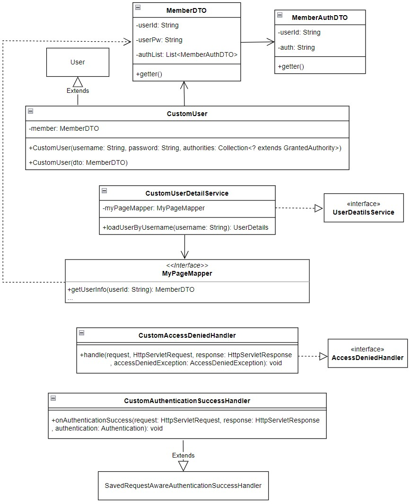

# Man's Shop 개인 프로젝트

<br/>

## 목적
* 시큐리티를 적용해 관리자와 사용자의 권한을 분리
* 결제 API 적용
* 현재 서비스 중인 쇼핑몰을 참고해 최대한 기능을 구현
* 실제 서비스되어도 될 정도의 수준까지 계속해서 개선하는 것이 목표

## Spring Boot 버전 github
* https://github.com/Youndae/mansshop_boot

<br/>

## 사용기술
* BackEnd
  * Spring 5.0.7
  * JDK 8
  * Maven
  * SpringSecurity 5.0.6
  * MyBatis
  * Lombok
  * Java Mail
  * commons-io
* FrontEnd
  * JSP
  * JQuery
  * Ajax
  * I'mport API
  * Kakao 우편번호 서비스 API
* DataBase
  * Oracle 18c
  * Redis(Docker)

<br/>

## 상품 데이터 및 참고 사이트
* 자뎅(https://zardins.com)

<br/>

## ERD


<br/>

## 기능
* 메인화면
  * BEST, NEW, 상품 분류별 목록 출력
  * 상품 리스트 페이징
  * 상품명 검색
  * 장바구니
    * 장바구니 상품 수량 증감
    * 장바구니 상품 선택 또는 전체 삭제
    * 장바구니 상품 선택 또는 전체 구매
  * 주문 조회(비 로그인시에만 출력. 로그인 시 마이페이지에서 조회 가능)
* 상품 상세
  * 상품 정보 출력
  * 상품 옵션 선택
  * 장바구니 담기
  * 관심상품 등록
  * 선택 상품 수량 증감
  * 선택 상품 결제
  * 상품 리뷰 리스트
  * 상품 문의 목록 출력 및 작성
* 마이페이지
  * 주문 목록
    * 배송완료 상품 리뷰 작성
  * 관심 상품 목록
  * 문의 내역
    * 상품 문의 내역
      * 문의 상세 정보
      * 문의 삭제
    * 회원 문의 내역
      * 문의 작성
      * 문의 상세 정보
        * 답변 작성
        * 문의 삭제
  * 작성한 리뷰 목록
    * 작성한 리뷰 상세 및 삭제
    * 리뷰 수정
  * 정보 수정
* 로그인
  * 회원가입
  * 로그인
  * 아이디 및 비밀번호 찾기
  * 로그아웃
* 관리자
  * 상품관리
    * 상품 목록
    * 상품 추가
    * 상품 상세 정보
    * 상품 수정
    * 재고 관리
    * 할인 설정
  * 주문 관리
    * 미처리 주문 목록
      * 주문 상세 정보
      * 미처리 주문 확인 처리
      * 미처리 주문 검색(받는사람, 아이디)
    * 전체 주문 목록
      * 주문 상세 정보
      * 전체 주문 검색(받는사람, 아이디)
  * 문의 관리
    * 상품 문의
      * 미답변 문의 목록
      * 전체 문의 목록
      * 문의 상세 정보
      * 문의 답변 작성
      * 문의 답변 처리
      * 문의 검색(닉네임)
    * 회원 문의
      * 미답변 문의 목록
      * 전체 문의 목록
      * 문의 상세 정보
      * 문의 답변 작성
      * 문의 답변 처리
      * 문의 검색(닉네임)
    * 문의 카테고리 설정
      * 카테고리 추가
      * 카테고리 삭제
    * 회원 관리
      * 회원 목록
      * 회원 상세 정보
      * 회원 주문 목록 조회
      * 회원 상품 문의 내역 조회
      * 회원 문의 내역 조회
      * 포인트 지급
    * 매출 관리
      * 기간별 매출
        * 당해 월별 매출 목록
        * 당해 매출, 판매량, 주문량 출력
        * 월 매출 상세 정보
        * 상품 분류별 월 매출 내역
        * 일별 매출 내역
        * 일별 주문 목록
      * 상품별 매출
        * 상품별 매출 정보 리스트
        * 상품 매출 상세 정보
        * 옵션별 매출 내역
        * 검색(상품명)
* 비회원
  * 메인 화면 모든 기능
  * 장바구니 사용(쿠키 활용)
  * 상품 주문
  * 주문 내역 조회(받는사람, 연락처)

<br/>

## 기능 정리

### 목차
* 백엔드
  * 인증 / 인가(SpringSecurity)
  * Oracle / MyBatis 환경에서 INSERT ALL 문제 발생 및 해결
  * Multipart/formData 요청에서의 문제
  * 주문 처리
* 프론트 엔드
  * JSTL의 사용

<br/>

## 백엔드

<br />

### 인증 / 인가


인증 / 인가에 대한 처리는 Spring Security로 처리했으며, 4개의 클래스를 생성해 Custom하는 방법으로 구현했습니다.   
AuthenticationSuccessHandler에서는 관리자 로그인의 경우 관리자 페이지로 이동하도록 했으며, 사용자는 referer를 통해 로그인 이전에 보고 있던 페이지로 연결할 수 있도록 처리했습니다.   
Spring Security 설정 방식은 xml 방식으로 처리했으며 암호화는 BCryptPasswordEncoder를 사용했고 csrf 토큰을 활성화 한 상태로 구현했습니다.
권한 처리는 PreAuthorize Annotation을 통해 메소드 혹은 컨트롤러 단위로 관리할 수 있도록 처리했습니다.

<br/>

### Oracle / MyBatis 환경에서 INSERT ALL 문제 발생 및 해결

리펙토링을 진행하게 되면서 데이터베이스 테이블 설계 역시 변경하게 되었습니다.   
이번 리펙토링은 Man's Shop Boot 버전과 동일한 기능을 제공하는 것으로 처리하는 것이 목표였고, 그에 따라 Boot 버전의 MySQL 설계를 그대로 가져와 사용했습니다.   
그러면서 각 테이블의 기본키가 NUMBER 타입으로 많이 수정되게 되었는데 이로 인해 INSERT ALL 시 Oracle에서 Sequence가 제대로 동작하지 않는 문제가 발생했습니다.   

문제는 INSERT ALL 처리시 2개의 데이터를 삽입했다고 할 때 1, 2와 같이 처리되어야 함에도 1, 1과 같이 처리되는 것이 문제였습니다.   
문제 원인을 확인해보니 Oracle에서는 INSERT ALL에 대해 Sequence를 매번 호출하는 것이 아닌 최초 호출된 Sequence를 재사용하기 때문에 발생하는 문제라는 것을 알 수 있었습니다.   

이 문제를 해결하기 위한 방법으로는 3가지 방법을 찾을 수 있었습니다.   
1. 애플리케이션 서비스 레이어에서 반복문을 통해 mapper를 여러번 호출하는 방법
2. 애플리케이션 xml에서 PL/SQL을 직접 작성해 처리하는 방법
3. 데이터베이스에 Procedure를 생성하고 xml에서 해당 Procedure를 호출해 처리하는 방법

이 방법들 중 3번 방법을 통해 문제를 해결했습니다.   
1번의 경우 적은 양의 데이터라면 문제가 큰 차이가 발생하지 않겠지만 반복문을 통해 여러번 mapper를 호출한다는 것은 계속해서 Connection 요청을 처리해야 한다는 단점이 있습니다.   
이 단점은 Connection Overhead를 증가시켜 성능 저하로 이어질 수 있습니다.   
개인 쇼핑몰이라는 규모의 애플리케이션에서 오버헤드로 인한 성능저하가 발생할 가능성은 낮다고 생각하지만 추후 확장 가능성을 생각한다면 좋은 선택지는 아니라고 생각했습니다.   

2번 방법과 3번 방법은 유사한 처리과정을 거치지만 2번 방법의 경우 애플리케이션의 xml에 PL/SQL을 직접 작성함으로써 타입 변환 등에 대한 신경을 덜 써도 된다는 장점이 있습니다.   
그러나 애플리케이션 환경에 종속적이게 된다는 문제와 PL/SQL 호출이 계속해서 중첩되면 오히려 1번 방법보다 더 큰 성능 저하를 발생시킬 수 있다는 문제가 있습니다.
그런 반면, 3번 방법은 데이터베이스에 Procedure를 직접 정의하기 떄문에 종속성 문제를 해결할 수 있습니다. 그러나, 종속되지 않기 때문에 데이터 타입 변환을 처리해야 한다는 단점도 있습니다.   
데이터 베이스에는 Procedure, Oracle 사용자 정의 타입을 정의해야 하고, 애플리케이션에서는 TypeHandler를 정의해야 하기 때문에 관리해야 할 부분들이 증가하게 됩니다.   
이 증가하는 양은 INSERT ALL을 처리해야 하는 만큼 증가하기 때문에 애플리케이션 규모가 커질수록 더 많은 양이 증가할 가능성이 있습니다.
그럼에도 3번 방법을 통해 문제를 해결하고자 결정한 이유는 애플리케이션에 종속되지 않도록 하기 위함과 관리 포인트가 증가하더라도 성능 저하의 우려가 적은 방법을 택하는 것이 최선이라고 생각했기 때문입니다.   

해당 방법을 통해 처리한 기능 중 하나는 상품 추가 시 여러개의 상품 옵션을 같이 처리해야 하는 부분입니다.   
Product 테이블 데이터를 저장한 후 ProductOption 리스트에 대해 다중 Insert 처리가 필요했습니다.   
그래서 Procedure 정의와 Oracle 사용자 정의 타입을 정의하고 TypeHandler를 정의해 처리했습니다.

```sql
CREATE OR REPLACE TYPE PRODUCT_OPTION_OBJ AS OBJECT (
    productId VARCHAR2(200),
    productSize VARCHAR2(20),
    productColor VARCHAR2(50),
    stock NUMBER,
    isOpen NUMBER(1, 0)
);

CREATE OR REPLACE TYPE PRODUCT_OPTION_OBJ_LIST AS TABLE OF PRODUCT_OPTION_OBJ;

CREATE OR REPLACE PROCEDURE insert_product_options (
    product_options IN PRODUCT_OPTION_OBJ_LIST
) IS
BEGIN
  FOR i IN 1..product_options.COUNT LOOP
    INSERT INTO productOption (productId, productSize, productColor, stock, isOpen)
    VALUES (product_options(i).productId
        , product_options(i).productSize
        , product_options(i).productColor
        , product_options(i).stock
        , product_options(i).isOpen
    );
  END LOOP;
END;
```

```java
//TypeHandler
public class ProductOptionTypeHandler implements TypeHandler<List<ProductOption>> {
    @Override
    public void setParameter(PreparedStatement ps
                              , int i
                              , List<ProductOption> parameter
                              , JdbcType jdbcType) throws SQLException {
        if(parameter != null && !parameter.isEmpty()){
          OracleConnection oracleConn = ps.getConnection().unwrap(OracleConnection.class);
          OracleStruct[] structArray = new OracleStruct[parameter.size()];
  
          for(int idx = 0; idx < parameter.size(); idx++) {
            ProductOption option = parameter.get(idx);
  
            Object[] optionAttributes = {
                    option.getProductId(),
                    option.getProductSize(),
                    option.getProductColor(),
                    option.getStock(),
                    option.isOpen()
            };
  
            OracleStruct struct = (OracleStruct) oracleConn.createStruct("PRODUCT_OPTION_OBJ", optionAttributes);
            structArray[idx] = struct;
          }
  
          OracleArray array = (OracleArray) oracleConn.createOracleArray("PRODUCT_OPTION_OBJ_LIST", structArray);
          ps.setArray(i, array);
        }else
          ps.setNull(i, Types.ARRAY);
    }

    @Override
    public List<ProductOption> getResult(ResultSet rs, String columnName) throws SQLException {
      return null;
    }
  
    @Override
    public List<ProductOption> getResult(ResultSet rs, int columnIndex) throws SQLException {
      return null;
    }
  
    @Override
    public List<ProductOption> getResult(CallableStatement cs, int columnIndex) throws SQLException {
      return null;
    }
}

//AdminServiceImpl
@Service
@Slf4j
@RequiredArgsConstructor
public class AdminServiceImpl implements AdminService {
    private final ProductOptionMapper productOptionMapper;
    //...
    
    @Override
    @Transactional(rollbackFor = Exception.class)
    public String insertProduct(AdminProductImageDTO imageDTO, AdminProductPatchDTO dto) {
        //...
        List<ProductOption> options = dto.getNewOptions().stream()
                                          .map(option -> option.toEntity(productEntity.getId()))
                                          .collect(Collectors.toList());
        Map<String, Object> params = new HashMap<String, Object>();
        params.put("options", options);
        productOptionMapper.saveOptions(params);
    }
}
```
```xml
<!-- ProductOptionMapper.xml -->
<insert id="saveOptions" parameterType="map">
        {CALL insert_product_options(
        #{options, jdbcType=ARRAY, jdbcTypeName="PRODUCT_OPTION_OBJ_LIST"
                , typeHandler=org.shop.mapper.typeHandler.ProductOptionTypeHandler}
        )}
</insert>
```

최근에는 접하는 강의에서도 그렇고 개발 블로그들을 둘러보더라도 테이블 기본키에 대해 정수형 데이터를 많이 사용하는 것을 볼 수 있었습니다.   
이유를 찾아보니 정수형 데이터를 사용하는 것이 문자열 데이터를 사용하는 것 보다 인덱싱이 빠르기 때문이라는 것을 알 수 있었습니다.   
프로젝트를 리펙토링하면서 더미데이터를 늘려보기도 하며 느낀점으로는 인덱싱 성능이 기능 처리 속도와 비례한다는 점을 느낄 수 있었기 때문에 Oracle에서도 Sequence를 활용한 처리가 많아질 것이라고 생각합니다.   
기능을 바로 처리해야 하는지 아닌지에 따라서도 달라질 것이고 예측되는 데이터양에 따라서도 선택지가 달라질 수는 있겠지만 최근 IT 업계내에서 많이 강조되고 있는 대용량 데이터 환경을 감안한다면 꼭 해봐야 하는 문제 해결 방법이었다고 느꼈습니다.   

Procedure를 정의하고 처리하는 방법의 테스트 및 기능 구현으로는 클래스 리스트만을 매개변수로 넘겨 처리하는 방법과 클래스 리스트와 단일 객체 데이터를 넘기는 방법, 단일 객체 리스트들만 여러개를 넘겨 처리하는 방법까지 3가지 방법으로 테스트해보고 구현해봤습니다.   
이 문제 해결 방법에 대해서는 블로그에 좀 더 상세하게 기록해두었습니다.

https://myyoun.tistory.com/240

<br/>

### Multipart/formData 요청에서의 문제

리펙토링을 수행하며 Multipart/formData 방식의 요청에 대한 문제가 발생했습니다.   
해당 문제가 최초 발생한 부분은 관리자 파트에서 상품의 수정 부분이었습니다.   
상품 수정 기능에서는 상품의 데이터, MultipartFile 타입의 대표 썸네일, String 타입의 삭제할 대표 썸네일명, MultipartFile 리스트 타입의 썸네일과 정보 이미지, String 리스트 타입의 썸네일과 정보이미지의 삭제 파일명, 옵션 리스트가 요청 데이터로 처리됩니다.   

리펙토링 이전의 컨트롤러에서는 해당 요청에 대해 아래 코드와 같이 처리했었습니다.

```java
//Controller
@PatchMapping("/product")
@ResponseBody
public String patchProduct(ProductModifyDTO dto
                        , @RequestParam(value = "firstThumbFile", required = false) MultipartFile firstThumbnail
                        , @RequestParam(value = "deleteFirstThumbnail", required = false) String deleteFirstThumbnail
                        , @RequestParam(value = "thumbnails", required = false) List<MultipartFile> thumbnails
                        , @RequestParam(value = "deleteThumbnails", required = false) List<String> deleteThumbnails
                        , @RequestParam(value = "infoImages", required = false) List<MultipartFile> infoImages
                        , @RequestParam(value = "deleteInfoImages", required = false) List<String> deleteInfoImages) {
    
}
```

1.0 버전 당시에는 옵션도 한번에 하나만 추가할 수 있었기 때문에 옵션 리스트도 따로 받지 않았고 옵션 정보와 상품 정보는 ProductModifyDTO로 받을 수 있었습니다.   
그리고 각 파일에 대한 데이터는 모두 @RequestParam을 통해 받도록 처리했습니다.    

이후 Boot 버전을 진행해보면서 이런 구조의 요청에서 바로 DTO에 매핑하면 더 깔끔하고 관리도 수월하지 않을까 라는 생각이 들어 개선하게 되었습니다.   
최종적으로 Boot 버전에서는 DTO에 받아 처리하도록 할 수 있었습니다.   
그래서 이번 리펙토링을 통해 이 프로젝트에서도 동일하게 DTO로 매핑하도록 처리하고자 했으나 오류가 발생했습니다.   
다른 데이터는 모두 정상적으로 매핑되는 반면 MultipartFile 타입의 데이터들은 정상적으로 매핑되지 않는 문제였습니다.

최초 구현 시 처리 코드는 아래와 같았습니다.
```java
@PatchMapping(value = "/product/{productId}", consume = {MediaType.MULTIPART_FORM_DATA_VALUE})
public ResponseEntity<String> patchProduct(@PathVariable("productId") String productId
                                    , @ModelAttribute AdminProductPatchDTO patchDTO
                                    , @ModelAttribute AdminProductImageDTO imageDTO
                                    , @RequestParam(value = "deleteOptionIds", required = false) List<Long> deleteOptionIds) {
    
}
```

AdminProductPatchDTO에 상품 정보와 AdminProductOptionDTO 리스트가 필드로 존재하고, AdminProductImageDTO에는 각 파일에 대한 필드와 삭제 리스트에 대한 필드가 존재합니다.   
그러나 AdminProductImageDTO에 정상적으로 매핑되지 않는 것을 확인했고 원인을 파악하고자 여러 방법으로 테스트를 했으나 문제를 해결할 수 없었습니다.   
그래서 다시 파일들을 @RequestParam으로 받도록 처리하니 문제가 해결되는 것을 알 수 있었습니다.   

해당 문제가 발생한 이유를 알아보니 Spring Boot에서는 @ModelAttribute를 통해 MultipartFile을 DTO에 매핑할 수 있으나, Spring MVC 환경에서는 정상적으로 매핑하지 못한다는 것을 알 수 있었습니다.   
Spring Boot는 Jackson과 통합되어 JSON 데이터 처리에 Jackson Library를 사용하기 때문에 DTO와 JSON의 변환이 더 매끄럽고, Spring Boot에서의 @ModelAttribute는 HTTP 요청을 처리할 때 파일 업로드와 다른 데이터 처리를 통합적으로 다룰 수 있도록 지원해준다는 것을 알게 되었습니다.   
반면, Spring MVC 환경에서는 Jackson 통합이 자동으로 이루어지지도 않고, HTTP 요청 처리에 있어서도 자동화 지원이 부족하기 떄문에 매핑이 안된다는 이유였습니다.   

그래서 DTO 구조를 조금 변경해 문제를 해결했습니다.   
AdminProductImageDTO는 각 파일에 대한 필드만 담도록 수정하고, AdminProductDeleteImageDTO라는 DTO를 새로 만들어 삭제 파일명들에 대한 필드만 담도록 처리했습니다.   
각 파일에 대해서는 @RequestParam으로 받고 컨트롤러에서 서비스를 호출하기 전 AdminProductImageDTO에 담아 서비스를 호출하도록 처리해 문제를 해결할 수 있었습니다.

```java
@PatchMapping(value = "/product/{productId}", consume = {MediaType.MULTIPART_FORM_DATA_VALUE})
public ResponseEntity<String> patchProduct(@PathVariable("productId") String productId
                                    , @RequestParam(value = "deleteOptionIds", required = false) List<Long> deleteOptionIds
                                    , @RequestParam(value = "firstThumbFile", required = false) MultipartFile firstThumbnail
                                    , @RequestParam(value = "thumbnails", required = false) List<MultipartFile> thumbnails
                                    , @RequestParam(value = "infoImages", required = false) List<MultipartFile> infoImages
                                    , @ModelAttribute AdminProductPatchDTO patchDTO
                                    , @ModelAttribute AdminProductDeleteImageDTO deleteImageDTO) {
    AdminProductImageDTO imageDTO = AdminProductImageDTO.builder()
                                                        .firstThumbnail(firstThumbnail)
                                                        .thumbnails(thumbnails)
                                                        .infoImages(infoImages)
                                                        .build();
    
    String result = adminService.patchProduct(productId, deleteOptionIds, imageDTO, deleteImageDTO, patchDTO);
    
    return new ResponseEntity<>(result, HttpStatus.OK);
}
```

이번 문제 해결로 인해 Spring Boot가 제공하는 설정에 대한 편의성에 대해 좀 더 알 수 있는 기회가 되었습니다.

<br />


### 주문 처리

주문 페이지 접근이 가능한 페이지는 장바구니와 상품 상세 페이지입니다.   
각 페이지에서 선택된 데이터를 서버에 전달하고 서버에서는 해당 데이터들을 파싱한 뒤 주문 페이지를 호출하는 구조입니다.   
여기서 Get 요청으로 처리하는 경우 데이터가 많아 오류가 발생하는 문제가 있었습니다.   
또한, 데이터들이 쿼리 파라미터로 전달된다는 문제도 있었기 때문에 다른 방법으로 문제를 해결하고자 했습니다.   

그래서 해당 기능을 Post 요청으로 처리하고 데이터를 처리한 뒤 HttpSession에 해당 데이터들을 담는 방법을 택했습니다.   
그리고 응답을 받은 Ajax에서는 처리 응답을 받으면 Get 요청을 보내게 되고 해당 Get 요청 메소드에서는 HttpSession에 저장된 데이터를 꺼내 그대로 Model에 담도록 처리했습니다.   

```javascript
//cart.js
//선택 상품 주문 버튼 onclick 함수
function selectOrderCart() {
    $.ajax({
      url: '/order/cart',
      type: 'POST',
      contentType: 'application/json',
      data: JSON.stringify(checkArr),
      beforeSend: function (xhr) {
          xhr.setRequestHeader(header, token);
      },
      success: function (result) {
          if(result === 'SUCCESS')
              location.href = '/order/cart';
          else 
              alert('오류가 발생했습니다.');
      }
    })
}
```
```java
@RestController
@RequestMapping("/order")
@Slf4j
@RequiredArgsConstructor
public class OrderRestController {
    private final OrderService orderService;
    private final CookieService cookieService;
    
    @PostMapping("/cart")
    public ResponseEntity<String> orderCart(@RequestBody List<Long> cartDetailIds
                                            , Principal principal
                                            , HttpServletRequest request
                                            , HttpServletResponse response
                                            , HttpSession session) {
        CartMemberDTO cartMemberDTO = cookieService.createCartMemberDTOToCartDetail(principal, request, response);
        OrderProductResponseDTO dto = orderService.orderCart(cartDetailIds, cartMemberDTO);
        
        session.setAttribute("orderResponse", dto);
        
        return new ResponseEntity<>(Result.SUCCESS.getResultKey(), HttpStatus.OK);
    }
}


@Controller
@RequestMapping("/order")
@Slf4j
@RequiredArgsConstructor
public class OrderController {
    @GetMapping("/cart")
    public String orderCart(HttpSession session, Model model) {
        OrderProductResponseDTO dto = (OrderProductResponseDTO) session.getAttribute("orderResponse");
        model.addAttribute("order", dto);
        
        return "order/orderPayment";
    }
}
```

위 코드는 장바구니 페이지에서 선택 상품 주문 버튼 클릭시 처리되는 코드입니다.   
페이지의 check-box를 선택할때마다 JQuery에서 이벤트를 감지해 checkArr 전역 변수에 cartDetailId라는 장바구니 상세 테이블 id 값을 배열로 저장합니다.   
버튼 클릭 이벤트 발생 시 해당 checkArr 데이터를 POST 요청으로 담아 보내게 되며 컨트롤러에서는 cartDetailIds 리스트를 통해 해당 id 값을 갖는 데이터들을 조회합니다.   
이후 session에 orderResponse로 담아 SUCCESS라는 응답을 반환합니다.   
'SUCCESS' 응답을 받은 ajax는 get 요청을 보내게 되고 해당 요청을 받은 메소드에서는 session에 저장된 orderResonse를 꺼내 주문 페이지로 연결할 수 있도록 처리했습니다.
장바구니가 아닌 상품의 경우 product 라는 경로로 처리하도록 했으며, 상품 옵션 테이블 id 인 optionIds 데이터를 담아 처리합니다.   

리펙토링 이전에는 @RestController를 따로 분리하지 않았기 떄문에 @Controller로 처리하고 있었고, Post 요청으로 데이터를 받아 페이지를 반환하는 형태였습니다.   
또한, 클라이언트에서 보내는 요청 데이터 역시 지금처럼 id 리스트를 보내는 것이 아닌 클라이언트에서 모든 데이터를 파싱한 뒤 보내 컨트롤러에서는 Map으로 받아 클래스에 매핑한 뒤 반환하는 과정이었습니다.   

이전에 처리할때부터 POST 요청에 대해 페이지를 반환하는 과정이 어색하다고 생각하고 있었고, 이 문제를 개선하고자 고민해왔었는데 이번에 session을 통해 문제를 해결할 수 있었습니다.

<br />

## 프론트 엔드

### JSTL 사용

이번 리펙토링을 통해 JSTL을 적극적으로 사용해 처리하는 방법으로 개선하게 되었습니다.   
기존에는 파싱에 필요한 데이터들에 대해 JQuery에서 getJSON으로 추가 요청을 보내고 응답 받은 데이터를 파싱 한 뒤 append로 추가해주는 형태로 구현했었습니다.   

이번 리펙토링에서는 페이지에 필요한 데이터는 컨트롤러에서 페이지 반환 시 모두 담아 보내도록 개선했습니다.   
최초 로딩 시 모두 출력되어야 하는 데이터들이고, JSTL로 제어가 가능한데 JQuery에서 로딩 이후 getJSON을 통해 추가 요청으로 처리하는게 비효율적이라고 생각했기 때문입니다.   
주로 c, fmt 태그를 가장 많이 사용했고, sec 태그는 간간히 추가해서 사용했습니다.

JSTL을 사용한 방법으로 가장 많이 개선한 페이지는 상품 상세 페이지 입니다.   
상품 상세페이지는 여러 테이블의 데이터들이 필요합니다.   
상품 데이터, 상품 옵션 리스트, 상품 정보 이미지 리스트, 리뷰 리스트, 문의 리스트 등이 필요하기 때문에 제어해야 할 데이터가 많았습니다.   
이전 버전에서는 상품 데이터만 컨트롤러에서 전달하고 썸네일, 정보 이미지, 옵션, 리뷰, 문의 리스트는 페이지 로딩 후 JQuery에서 getJSON을 통해 받아오도록 처리했습니다.   
그러나 이번 버전에서는 모든 데이터를 컨트롤러에서 최초 전달하도록 하고, 페이징 기능이 들어간느 리뷰와 문의 리스트에 대해서만 페이징 버튼 이벤트에 따라 getJSON으로 처리하도록 개선했습니다.   

productDetail.jsp 전체 코드는 아래 링크에서 확인하실 수 있습니다.
https://github.com/Youndae/mansShop/blob/master/src/main/webapp/WEB-INF/views/product/productDetail.jsp

해당 페이지에서 개선된 기능 중 옵션에 대해 이전 버전에서는 아래와 같이 처리했습니다.

```html
<!-- 옵션 select-box -->
<div class="product-detail-select mgt-4">
  <label>옵션</label>
  <select id="option-select-box">
    
  </select>
</div>
```
```javascript
$(function() {
    const pno = $("#pno").val();
    $.getJSON('/product/option', {pno: pno}, function (arr) {
        let str = "<option value=\"default\">-----</option>";

        $(arr).each(function (i, op){
            let optionStr = '';
            const sizeOption = "<option value=\"" + op.popNo + "/" + op.psize + "\">" +
                    "사이즈 : " + op.psize + "</option>";
            const colorOption = "<option value=\"" + op.popNo + "/" + op.pcolor + "\">" +
                    "컬러 : " + op.pcolor + "</option>";
            const defaultOption = "<option value=\"" + op.popNo + "\"></option>";
            const colorSizeOption = "<option value=\"" + op.popNo + "/" + op.pcolor + "/" + op.psize + "\">" +
                    "컬러 : " + op.pcolor + "     사이즈 : " + op.psize + "</option>";
  
            if(op.pcolor == null && op.psize != null)
              optionStr = sizeOption;
            else if(op.pcolor != null && op.psize == null)
              optionStr = colorOption;
            else if(op.pcolor != null && op.psize != null)
              optionStr = colorSizeOption;
            else
              optionStr = defaultOption;
  
            str += optionStr;
        })
        $("#option-select-box").append(str);
    })
})
```

이 방식과 유사한 방법으로 썸네일, 정보 이미지, 리뷰, 문의 리스트까지 처리했습니다.   
그러다보니 상세페이지 요청이 한번 발생하고 나면 추가적으로 5번의 요청이 더 발생하는 구조였습니다.   
최초 페이지 로딩 시 필요한 데이터들인데 너무 많은 횟수의 요청이 발생하고, 이 데이터들의 제어는 JSTL로 충분히 처리할 수 있기 때문에 전체 데이터를 넘겨주는 방식으로 개선했습니다.

```html
<div class="product-detail-select mgt-4">
  <labal>옵션</labal>
  <select id="product-detail-option-select-box">
        <option value="default" selected hidden>옵션을 선택해주세요</option>
        <c:forEach items="${product.options}" var="option">
          <c:set var="result" value=""/>
          <c:set var="optionValue" value="${option.optionId}"/>
          <c:if test="${options.PSize ne null}">
            <c:set var="result" value="사이즈 : ${option.PSize}"/>
            <c:set var="optionValue" value="${optionValue}/${option.PSize}"/>
          </c:if>
          <c:if test="${option.color ne null}">
            <c:if test="${not empty result}">
              <c:set var="result" value="${result}, "/>
            </c:if>
            <c:set var="optionValue" value="${optionValue}/${option.color}"/>
            <c:set var="result" value="${result}컬러: ${option.color}"/>
          </c:if>
          
          <c:choose>
            <c:when test="${option.stock == 0}">
              <option value="${optionValue}" disabled>${result}</option>
            </c:when>
            <c:otherwise>
              <option value="${optionValue}">${result}</option>
            </c:otherwise>
          </c:choose>
        </c:forEach>
  </select>
</div>
```

금액과 같은 데이터에 대해서는 fmt:formatNumber 를 통해 3자리 단위 ' , '를 찍을 수 있도록 처리했습니다.

<br />

---
# History

>2021/05/20   
>   * 프로젝트 기본 셋팅 및 테스트   
>   * DB 설계
   
>2021/05/21
>   * DB 연결 테스트 및 확인
>   * Controller에 메서드 먼저 작성중   

>2021/05/27
>   * 클래스 다이어그램에 맞춰 메서드 작성 완료   

>2021/05/28
>   * 시큐리티 적용 테스트 위해 관리자 상품목록 페이지, 사용자 정보수정 페이지 약식으로 작성
>   * 작성 후 PropertyNotFoundException에러 발생했으나 해결.
>   * 상품 이미지 캡쳐랑 오류 해결하는데 너무 오래걸려서 시간 많이 지체되었으므로 좀 빠르게 작업해야함.
>   * 시큐리티 테스트 바로 하고 관리자파트 먼저 구현하는쪽으로.

>2021/05/31
>   * security 설정 중
>   * DB에 회원 데이터 넣으려고 테스트 작성했는데 passwordEncoder 오류.
>   * UnsatisfiedDependencyException발생.

>2021/06/01
>   * UnsatisfiedDependencyException 해결.
>   * PasswordEncoder는 security-context.xml에 정의해놓고 ContextConfiguration에 applicationContext.xml만 사용해서 오류 난 것.
>   * security 테스트 완료
>   * security 테스트하면서 권한에 따른 페이지 이동과 이전 페이지 등 테스트.
>   * 기존 AuthenticationSuccessHandler를 재정의하던 LoginSuccessHandler 대신
>   * SavedRequestAwareAuthenticationSuccessHandler를 상속받는 CustomAuthenticationSuccessHandler로 변경.
>   * 로그인 시 이전페이지로 이동하기 위함. 그리고 관리자는 로그인하면 바로 관리자 페이지로 이동.

>2021/06/03
>   * 회원가입 구현중.
>   * 아이디 중복체크 구현중에 ajax 부분 문제 발생.
>   * 403에러 출력되는 중이고 ajax success에 unused property 라는 오류가 발생.
>   * 오류내용이 제대로 출력되지 않고 accessError로 자꾸 넘어가서 
>   * security-context.xml에 customAccessDeniedHandler 주석처리.

>2021/06/04
>   * 403에러 해결.
>   * 권한문제였고 csrf를 같이 넘겨줘야 하는데 안넘겨줬기 때문에 발생한 오류.
>   * token과 header를 같이 넘겨주는 방법으로 해결함.
>   * 회원가입 정규표현식 작성.
>   * 아이디 중복체크, 비밀번호 확인 작동 확인.
>   * 문제해결 블로그에 포스팅 완료.

>2021/06/07
>   * 회원가입 구현 완료.
>   * form data가 제대로 넘어가지 않는 오류가 있었으나 input에 name을 정의하지 않고 그냥 넘겼기 때문에
>   * 발생한 오류로 해결 완료.
>   * 회원가입 시 모든 정보를 입력해야 가입할 수 있도록 조건 처리.
>   * 각 항목이 제대로 입력되지 않았을 때 overlap이 공백이 아닌 상태이므로 그것을 이용해 처리하려고 했지만
>   * 원하는 형태의 데이터를 갖고 오지 못해 각 항목별로 check 라는 input을 만들어 처리.
>   * 너무 지체되는것 같아서 이렇게 처리해두고 후에 리팩토링 할 것.
>   * 데이터 처리 중 한글이 깨지는 오류가 발생.
>   * web.xml에서 filter-mapping에서 <servlet-name>dispatcher</servlet-name>으로 작성했는데
>   * <url-pattern>/*</url-pattern>으로 변경하니 해결.
>   * 이전 시큐리티 공부할때는 같은 조건의 셋팅에서 문제가 없었는데 이번에 왜 문제가 생겼는지 원인 파악이 안됨.
>   * ####원인파악 꼭 할 것.

>2021/06/08
>   * admin 페이지 먼저 작성 시작.
>   * 상품 등록 구현 중 설계 수정.
>   * 처음에는 상품 리스트에서 상품 선택하면 모달창으로 보여주도록 설계했으나 썸네일 및 정보이미지도 보여야 하고
>     상품별 옵션이 다양할 수 있는데 모든 경우의 수에 대해 중복된 데이터를 직접 입력하며 추가해야 하는 부분에서
>     불편함이 있다고 판단.   
>     하나의 상품을 등록하고 누르면 모달창이 아닌 수정페이지로 이동하고 그 수정페이지에서 상품 정보를 수정하거나
>     사이즈 및 컬러, 재고만 변경해서 새로 추가할 수 있는 형태로 변경.
>   * exerd도 재설계하면서 제대로 수정되지 않은 부분이 있어서 수정.
>   * 썸네일을 여러장으로 구현하고 싶은데 대표 썸네일을 어떻게 처리할까 고민하다가 Product 테이블에 대표썸네일 컬럼을 만들고
>     대표썸네일을 따로 파일선택 하도록 하는 방향으로 진행.
>   * 이미지 업로드 구현중.
>   * 이미지 preview 생성 및 삭제 구현 중.

>2021/06/09
>   * 이미지 preview 생성 및 삭제 구현 완료.
>   * 등록 구현 중.
>   * form데이터가 컨트롤러로 제대로 넘어가지 않는 오류 발생.
>   * 해결중.

>2021/06/10
>   * 415에러 해결
>   * 문제해결 블로그에 포스팅 완료.
>   * 이미지 저장 프로젝트 내부에 하려고 하는데 경로가 계속 target 아래로 잡혀서 해결중

>2021/06/11
>   * 경로문제 미해결.
>   * 이방법 저방법 다 해보고는 있는데 관련된 정보가 너무 없는상태...
>   * 정 안되면 프로젝트 내부에 하지 않는 방법으로 변경해야 할듯.

>2021/06/14
>   * 경로문제 해결 안됨.
>   * 보통 서버 내 별도 공간에 저장한다고 하는 글들이 보여 데스크탑에 저장하고 불러오는 형태로 구현하기로 결정.
>   * E:\upload 폴더로 저장경로 정했고 테스트까지 완료.
>   * 추후 getRealPath()에 대해서는 따로 여러가지 테스트로 해결이 필요함.
>   * 내일은 테스트한 부분들 다 정리하고 제대로 구현해야 함.

>2021/06/15
>   * 상품 등록 구현 완료.
>   * 상품 정보화면 구현중.
>   * 상품 정보 기본적인 데이터 출력 구현 완료.
>   * 이미지 출력 및 이미지 수정, 삭제 재등록부터 구현해야 함.
>   * 업로드 폴더 E:\upload\Product로 변경

>2021/06/16
>   * 이미지 출력 구현완료.
>   * 수정 삭제 구현해야함.

>2021/06/17
>   * 이미지 수정 및 삭제 구현 완료.
>   * 이미지파일까지 삭제하는것 구현 완료.
>   * pno와 pOpNo를 잘못 설계해서 수정필요.
>   * pno는 Classification과 SimpleDateFormat, currentTimemillis를 이용해
>   * 생성해서 만드는 쪽으로 변경했고
>   * pOpNo 고민중.
>   * 이미지는 변경하지 않고 정보만 변경하는 케이스 구현 완료.

>2021/06/21
>   * pOpNo 역시 pno와 마찬가지로 구성하나 앞에 Op_를 붙여 처리하기로 결정.
>   * pOpNo는 처음 옵션을 생성할 때 만들어진 값에서 수정이 안되는 쪽으로.
>   * 계속 변경하는 방법으로 생각해본것은 따로 newpOpNo 형태로 새로 만들어서 기존 번호로 검색하고
>   * 새로운 값을 넣어주는 형태를 생각해봤는데 옵션번호의 구성이 꼭 해당 옵션 정보가 들어가야 한다는 조건이 아니라면
>   * 좀 불필요하다는 판단.
>   * 상품 옵션과 상품은 삭제하는 것이 아닌 비공개처리로 출력되지 않도록 변경.
>   * pClosed 컬럼으로 0은 공개 1은 비공개로 설정.
>   * 매출 내역 출력을 위해 DB에서 삭제하지 않기로 결정함.
>   * 상품 공개, 비공개 처리 및 옵션 공개, 비공개 처리 완료.
>   * 상품 리스트에 상품별이 아닌 상품 옵션별로 출력되도록 수정하면서
>   * 옵션에서 color와 size도 같이 출력하도록 변경.
>   * 리스트 출력 및 수정 페이지로 이동, 수정 기능, 옵션 추가기능, 공개, 비공개 설정기능 구현 완료.

>2021/06/22
>   * productList페이지 페이징과 검색기능 구현 완료.
>   * mapper.xml에서 classification과 keyword가 처음에는 null로 넘어가지만
>   * 페이징 기능으로 이동시에 null이 아닌 상태로 넘어가서 조건 작성해야함.
>   * 그리고 List 페이징 view테이블 만들어서 처리했는데 다른 방법 있는지 생각해볼것.

>2021/06/23
>   * productList페이지 전체 구현 완료.
>   * 어제 발생했던 문제점 해결.
>   * 주문내역 작성중.
>   * orderList 출력을 주문건으로 변경하면서 DB 테이블 분리.
>   * p_order테이블 하나에 몰아서 저장했던것을 p_order와 p_order_detail로 분리해서 저장하는 쪽으로 변경
>   * p_order테이블에는 주문건 세부 옵션들(상품 옵션별 갯수 및 금액)을 저장하도록 변경.
>   * 주문목록 모달창 로직 고민중.

>2021/06/24
>   * 주문목록 모달창 작성 완료.
>   * 배송처리 기능 완료. 기존 계획과 다르게 리스트에서 배송처리 하는것이 아닌
>   * 모달창에서 세부정보를 확인할 수 있게 바꿨기 때문에
>   * 모달창 내에 버튼을 만드는게 낫다고 생각해서 변경.
>   * QnA 구현완료. 리스트와 상세, 댓글까지 구현 완료.
>   * QnA의 경우는 jquery 양이 적어서 adminOrder.js에 같이 작성.
>   * userList페이지 리스트, 페이징, 검색 구현 완료.
>   * userInfo 모달창으로 구현하는 부분부터 하면 됨.

>2021/06/25
>   * 회원목록 페이지 전체 구현 완료.
>   * 매출정보 페이지 구현 중.
>   * 상품별 매출페이지는 구현되었고 기간별 매출 구현.
>   * 현재 select-box로 연도별, 월별로 나눴는데 좀 불편한것 같아서 연도별은 연도만 월별은 해당 연도의 월만 표시하는쪽으로 변경하는게 좋을듯.
>   * 예를들어 생년월일 하는것 처럼 구현하고 연도만 선택했을때는 해당 연도의 각 월별 매출과 연매출을 출력해주고
>   * 월까지 선택하면 해당 연 월의 매출에 대해서만 출력하는 쪽으로 계획 중.

>2021/06/29
>   * 기간별 매출 페이지 수정.
>   * 월별은 없이 연도별로만 검색할 수 있도록 변경.
>   * 대신 연도별로 보게 되면 12개월 전체의 데이터를 확인할 수 있도록 해서 해당 연도의 모든 월 매출을 바로 확인할 수 있도록 변경했고
>   * 테이블 하단에는 해당 연도의 연매출이 출력되도록 변경.
>   * 월 검색은 연도마다 겹치기도 하고 연도별 테이블로 확인하는게 더 보기 편할것 같다는 판단에 변경.
>   * admin페이지 구현 완료. nav랑 header만 마지막에 추가해주고 css만 작성하면 끝.
>   * admin 전체 페이지 및 기능 security 활성화 및 체크 완료.
>   * 상품 목록 페이지 구현을 위해 상품 데이터 넣는중.

>2021/06/30
>   * 메인페이지 구현.
>   * 상품 상세페이지 구현중.
>   * 썸네일 부분은 구현완료.
>   * 정보 출력도 구현하였고 옵션 선택 현황을 보여주는 테이블 구현중.

>2021/07/01
>   * 상품 상세페이지 구현중.
>   * 상품 정보 이미지 출력 구현완료.
>   * 옵션 선택 시 현황 테이블과 총 금액 출력 구현 완료.
>   * 현황테이블에서 개수 조정시 금액 및 개수 변경 구현 완료.
>   * 리뷰 출력 구현 완료. 페이징 구현해야함.
>   * 원래 계획이었던 정보, 리뷰, 문의, 주문정보 버튼을 눌렀을 때 해당 구역만 변경되는 것이 아닌
>   * 스크롤이 이동하는 형태로 계획 변경.

>2021/07/02
>   * 상세페이지 아직 구현중.
>   * 리뷰 출력 및 페이징 구현 완료.
>   * 상품 문의 구현 및 계층형 출력 완료.
>   * 상품 문의 페이징 및 등록 구현 완료.
>   * 주문정보는 데이터를 따로 가져오지 말고 그냥 jsp에 작성하는쪽으로 결정.
>   * member권한으로 로그인 시 페이지 이동이 제대로 이루어지지 않는 오류 발생 중.
>   * 상품 문의 등록 시 로그인 하지 않은 사용자는 등록할 수 없도록 수정 필요.

>2021/07/05
>   * 상세페이지 관심상품 구현 완료.
>   * 관심상품 등록 시와 등록 전 출력에 대해 고민해볼것.
>   * 주문정보 작성 완료.
>   * 장바구니 버튼 기능 구현중.

>2021/07/06
>   * 장바구니 버튼 기능 구현 완료.
>   * 바로구매는 주문 페이지 작성 후 구현으로 잠시 보류.
>   * 장바구니 페이지 구현중.
>   * 수량 증감 구현 완료 했고 수량에 따른 가격 변동 구현중.

>2021/07/07
>   * 장바구니 구현 완료.
>   * 주문페이지 구현 후 장바구니 페이지의 선택상품 주문과 상품 상세페이지 바로구매 기능 구현 할것.

>2021/07/09
>   * 장바구니에서 주문페이지로 데이터 넘겨 처리하도록 구현 완료.
>   * 주문페이지 결제 api 구현 완료.
>   * 결제했을때 처리되야할 데이터들 전부 처리 완료.
>   * 주문페이지에서 남은건 주소 api하나만 적용하고 제대로 들어가는지만 확인하면 끝.
>   * 상품 상세페이지에서 바로구매 클릭 시 넘길 수 있도록 추가 작성 필요.

>2021/07/12
>   * 결제페이지에 주소 api적용 완료. daum 주소 API사용.
>   * 상품 상세페이지에서 바로구매 기능 구현 완료.
>   * 바로구매일때와 장바구니 상품 구매 시 장바구니 데이터 삭제 여부 구현완료.
>   * 무통장입금시 출력 페이지 구현할것.

>2021/07/13
>   * 결제완료 페이지 구현 완료.
>   * 사용자 주문내역 페이지 구현중.
>   * 구성은 무한스크롤 혹은 기간별 출력 둘중 하나 고민중.
>   * view테이블 생성해서 처리.
>   * 4개 테이블 조인으로 인해 memberOrderListDTO 생성.
>   * json으로 받아와 출력할 예정인데 각 주문별 해당 날짜에 맞게 어떻게 그룹을 구성해 출력할지 고민해야함.

>2021/07/15
>   * 사용자 주문내역 페이지 구현 완료.
>   * select_box로 3개월, 6개월, 12개월, 전체를 선택해 볼 수 있도록 하는방향으로 구현.
>   * 페이지 로딩시 기본 출력은 3개월 내의 결과로 출력하도록 구현.
>   * 주문현황은 db에는 0,1,2형태로 저장. default는 0으로 배송준비중, 1은 배송중, 2는 배송완료로
>   * 배송완료된 상품은 리뷰를 작성할 수 있도록 버튼이 출력.
>   * 만약 리뷰가 이미 작성된 상태라면 버튼이 출력되지 않도록 구현.
>   * 리뷰 작성페이지 구현할것.

>2021/07/20
>   * 리뷰작성페이지 구현중.
>   * 리뷰 데이터 저장까지는 구현되었고
>   * 주문 상세 테이블에서 리뷰 현황을 업데이트 하는 기능 구현중.
>   * 주문목록페이지에서 리뷰작성 버튼 눌렀을 때 상품 옵션번호만 넘겨주도록 되어있는데
>   * 상품번호와 주문번호를 넘겨주는 쪽으로 변경해야함.

>2021/07/21
>   * 리뷰작성 구현 완료.
>   * 상품번호, 주문번호, 상품옵션번호 세가지를 넘겨서 처리.
>   * 리뷰상태 업데이트까지 구현완료.
>   * 고객 문의 List와 Detail까지 구현완료. 댓글출력까지 구현끝.
>   * 고객문의에서는 고객이 따로 댓글을 달지 않도록 변경할 계획이라 현재 상태로 마무리.

>2021/07/22
>   * 관심상품 구현 끝. 버튼 저상태 그대로 할지 아니면 앞에 그림 넣고 좀 변화를 줄지는 후에 프론트 작업하면서 결정할것.
>   * 기능구현 끝.
>   * JS파일로 전부 분리하고 중복되는 코드들 체크해서 정리필요. 주석도 테스트 코드들은 삭제.
>   * 다음부터는 처음부터 분리해서 작성할것...

>2021/07/23
>   * JS파일로 분리한 뒤 발생되고있는 오류 해결중.
>   * 오류사항
>       * 상품 상세에서 썸네일 클릭 시 페이지가 이동되는 오류 발생.
>           * (main페이지와 같은 JS파일에 작성했는데 pno가 겹치는것 때문에 발생하는 문제로 product.js파일에 따로 분리함으로 해결.)
>       * 상품 상세에서 옵션 삭제 불가 오류.
>           * (tr의 value가 아닌 id로 찾았어야 하는데 value로 잘못 작성. id로 변경해서 해결.)
>       * 상품 상세에서 옵션 추가 후 삭제할때 중간 옵션 삭제후 하나 추가 한 뒤에 맨 마지막을 삭제하면 두 옵션이 삭제되는 오류.
>           * (num 변수로 추가되는 옵션을 구분할 수 있도록 했는데
>           삭제할때 num--로 감소시키다 보니 중간 옵션을 삭제 후 다시 추가하게 되면 맨 마지막에 있던 옵션과 동일한 값을 갖게 되는 문제.
>           하지만 바로구매와 장바구니로 보낼때 해당 id값으로 찾기 때문에 다른 방법을 강구.
>           기존 코드는 바로구매 혹은 장바구니 버튼을 눌렀을 때 배열에 넣어 처리하는 방식이었지만 애초에 옵션이 추가되는 시점에서 배열에 추가 하는 방법으로 변경.
>           옵션 삭제 역시 삭제시 배열에서 해당 인덱스의 값을 삭제하는 방법으로 처리.
>           하지만 가격과 구매갯수는 옵션을 추가할때 가져오면 안되므로 버튼을 눌렀을 때 처리해야된다고 판단.
>           num 변수를 받아주는 배열을 하나 만들어서 옵션 추가 및 삭제시에 배열에 추가 및 삭제를 해줌으로써 해당 배열내의 값으로
>           버튼 동작시에 id값을 찾을 수 있도록 작섬함으로 해결.)
>       * 관리자 로그인 시 관리자 페이지로 이동하는 것이 아닌 modifyInfo페이지로 이동하며 관리자 페이지에 접근하려 하면 로그인페이지 출력.
>           * (main.js로 분리하면서 발생한 오류. 짧은 코드이기 때문에 form 이 role='form' 형태였고 jQuery에서는 $("form").submit() 형태로 처리.
>           js파일을 분리하다보니 해당 form에대해 인식을 제대로 하지 못했고 그래서 form에 id값을 줌으로써 로그인 문제는 해결.
>           페이지 이동에 대한 문제는 로그인 버튼이 a태그로 만들어진 형태였고 href='/member/modifyInfo' 이렇게 붙여놨으니 당연히 계속 modifyInfo페이지로 이동했던것.
>           button태그로 바꿔주었고 form.submit() 으로 처리하기 때문에 정상적으로 처리 완료.)
>       * 상품을 장바구니에 넣을때 중복된 상품에 대한 오류.
>           * (장바구니는 결제하면 삭제되므로 기본키가 중복될 수도 있는 패턴으로 작성되었는데 같은 옵션의 상품이 들어가게 되면 이 기본키가 중복되는 경우가 발생.
>           여러 사이트를 확인해보니 장바구니에 존재하는 상품을 다시 넣을 경우 개수만 증가하거나 아니면 추가상품 형태로 생성되는 것을 확인했고
>           추가상품보다는 개수를 증가시키는 형태가 낫다고 판단해서 장바구니에 넣을때 기존에 있는 상품인지 확인하고 없으면 insert 있으면 update형태로 수정)
>       * 사용자 주문목록 전체 출력이 안되고 일부만 출력되는 오류.
>           * (데이터오류. 주문테이블에 insert되면 주문상세테이블역시 insert가 무조건 하나라도 되어야 하는데 이전에 테스트한 데이터들이 주문테이블에만 들어가있었고
>           그걸 생각하지 못하고 리스트가 제대로 출력되지 않는다고 판단한데에서 발생한 문제. 결과적으로 오류가 아니었음.)
>       * 배송완료 상품 리뷰 작성 500에러. orderNo가 NullPointException. 리뷰 작성은 처리되나 ReviewStat 변경에서 오류.
>           * (ProductReviewVO에서 ProductVO를 상속받아 사용하기때문에 pno는 받을 수 있지만 orderNo는 받을 수 없었기에 orderNo가 null이었던 오류.
>           @RequestParam을 사용해 orderNo를 따로 받아주도록 하고 pno와 orderNo만을 넘겨 reviewStat을 update.
>           동일한 상품의 다른 옵션인 경우는 하나의 리뷰만 작성해도 전부 작성 처리 되도록 구현.)
>       * 장바구니 선택상품 삭제처리 오류. 아무 동작을 하지 않는 상태.
>           * (시큐리티 적용하기 전 강제로 아이디를 넣어줬는데 그 코드를 삭제하지 않아서 발생한 오류. 코드 삭제 후 아이디 받아서 처리하도록 수정.
>           그리고 장바구니 내에서 개수 조절하면 바로바로 DB에도 적용되도록 구현.)
>       * 주문 완료페이지에서 주문내역 보기 버튼 동작하지 않음.
>           * (연결 완료. 그리고 비회원 조회할 수 있도록 구현. 로그인이 되어있지 않으면 로그인페이지로 이동하는것이 아닌 주문자이름과 주문자연락처를 통해 검색할 수 있도록 구현.
>           비회원이 자주 구매하지는 않을거라고 생각해서 기간별 분류는 따로 하지 않는쪽으로 하고 리뷰는 회원만 작성이 가능하도록 설정.)
>       * 결제 후 DB에 정상적으로 insert되지 않음. productOrder테이블과 productOrderDetail에 전혀 insert되지 않음. 결제는 정상처리.
>           *   (service단을 주석처리해놔서 발생한 오류. 주석해제 하니 정상 처리 되었지만 이전에 orderDetail에 pno를 추가한것으로 인해 새로운 오류가 발생.
>           기존에는 pno가 없는 상태로 구현한 상태였기 때문에 pno를 같이 넘겨줘서 처리할 수 있도록 수정.)

>2021/07/26
>   * 오류 전체 수정 완료.

>2021/07/27
>   * header 레이아웃 작성 완료.
>   * 모든 페이지에 header 적용.

>2021/07/28
>   * main페이지와 상품상세페이지 css적용 완료.
>   * 기존 계획과 다르게 상품 문의는 댓글형태로 작성하는것이 아닌 작성페이지를 따로 만드는쪽으로 결정.
>   * 문의 작성페이지는 추후 프론트 다 끝나고 나면 추가할 것.
>   * 현재 상세페이지에서 정보 메뉴 버튼 눌렀을때 header에 가려지는 문제 발생.
>   * 상세페이지에서 상품 옵션 선택 시 나오는 테이블에서 up, down, delete 버튼 아직 결정 못함.

>2021/07/29
>   * 마이페이지 css 작성중.
>   * 회원가입, 로그인, 장바구니, 사용자 문의, 정보수정, 찜목록은 완료.

>2021/07/30
>   * 관리자 페이지 대부분 css 작성 끝.
>   * 매출정보 페이지만 적용하면 완료.
>   * 마이페이지에서 memberOrderList css누락 확인. 추가할것.

>2021/08/02
>   * 모든 페이지 프론트 작업 완료.
>   * DB 시퀀스 적용할것.
>   * DB 주문목록 데이터 잘못 넣었던 데이터들 있으니 초기화 후 다시 넣을것.
>   * 상품 데이터 마저 넣기.

>2021/08/03
>   * 관리자가 상품문의 목록이나 답글을 달 수 있는 페이지가 누락되어 추가 구현.
>   * 별도의 List를 만들고 Detail페이지로 들어가 확인한 뒤 댓글 형태로 그 페이지에서 바로 달 수 있도록 했고
>   * 작성한 답글은 댓글처럼 작성되는 형태의 디자인이지만 작성 후 출력되는 형태는 계층형 게시판 형태로 리스트에서 출력.
>   * admin페이지의 sidenav에 상품문의 메뉴 추가.
>   * 상품 상세페이지에서 상품문의를 작성하는 페이지를 별도로 만드는것이 아닌 댓글을 작성하듯이 상세페이지에서 바로 작성하도록 구현.
>   * 로그인을 하지 않은 상태일 경우 상품문의 버튼이 disable상태.
>   * 비회원의 경우 장바구니기능을 이용할 수 없도록 수정.
>   * mainController에 있던 상품 관련 메서드들 전부 productController로 이동.
>   * mainService로 처리하던 로직들이 전부 productController로 이동함으로 mainService와 impl을 삭제하고 productService, impl 생성해서 구현.
>   * 모든 컨트롤러의 메서드에 security 적용.
>   * DB 시퀀스 생성 완료 및 해당 쿼리문 sequence로 변경 완료.
>   * 전체적으로 정상 작동하는지 테스트 할것.

>2021/08/04
>   * 전체 테스트 완료 및 오류사항 수정 완료.
>   * 주석 삭제 완료.
>   * 프로젝트 종료.

> ##프로젝트 후기
>   이번 프로젝트는 최대한 많은 기능을 넣고 효율적으로 잘 코드를 짜는것이 목표인 프로젝트였다.   
>   마무리한 지금 되돌아 봤을 때 그래도 나름 만족스러운 결과물이 나온것 같다.   
>   가장 아쉬운 부분은 아직 스프링 시큐리티에 대해 많은 기능을 사용하지 못한것 같다는 것과 CSS 작성의 미숙이다.   
>   그리고 설계단계에서의 계획과 너무 많은 차이가 발생했다.
>   처음 설계 당시에 만들었던 테이블 명세서와 현재 DB 설계도 변경이 꽤 많은 상태고 클래스다이어그램 역시 차이가 많다.   
>   최대한 설계 계획과 동일하게 해보려고 했으나 구현하다보니 설계가 미흡한 부분이 너무 많았고 수정이 불가피했다.   
>   이번을 계기로 설계를 좀 더 자세하고 꼼꼼하게 해야겠다는 것을 느꼈다.   
>   
>   기능면에서는 최대한 컨트롤러에서 로직을 수행하는것이 아닌 서비스단에서 수행하도록 코드를 작성했고   
>   완전 동일한 기능이 아니더라도 비슷한 기능이라면 최대한 묶을 수 있는 쪽으로 구현하도록 작성해보았다.   
>   아직 경험이 부족하다보니 '이걸 전부 다 서비스로 넘겨서 굳이 처리해야 하는가' 라는 생각에 컨트롤러에서의 조건이 발생한 경우도 있는데   
>   이건 정말 경험을 쌓아야 좀 깨달을 수 있는 부분일 것 같다는 생각이 든다.
>   그리고 VO와 DTO에 대해 좀 더 고민을 해봐야 할 것 같다.   
>   아무래도 의견이 나뉘는 부분이다보니 편한것 혹은 팀에서 정한 방법으로 사용하면 된다고는 하지만 그래도 개인 프로젝트에서만큼은 딱 정해놓고   
>   작업할 수 있도록 설계 단계에서 결정을 하고 작업해야 할 것 같다.   
>      
>   처음으로 간단한 게시판이 아닌 전체적인 사이트를 혼자 진행해봤는데 예상보다는 긴 기간동안 프로젝트를 진행하게 되었지만   
>   그래도 이제는 '이 부분은 이걸 사용해서 이렇게 구현하면 되겠구나' 라는 생각이 좀 더 빨리 들 수 있도록 많은 도움이 된 프로젝트였던 것 같다.   
>   
>   이번 프로젝트의 중점이었던 시큐리티의 적용과 이미지 업로드 및 출력, 그리고 관리, 결제 API의 사용을 잘 구현했기에 그래도 만족스러운 프로젝트였다.
>      
>      
> ##추후 리펙토링 사항(생각날때마다 계속 추가할 것)
>   * CSS 반응형으로 변경
>   * CSS를 압축해 중복되는 부분 최대한 줄이기
>   * 알람 기능 및 채팅기능 추가
>#
>
>2022/04/06
>   * adminController와 MainController에 중복으로 있던 /display를 MainController에서만 사용하고   
>     Admin 페이지에서 MainController에 있는 display를 사용하도록 변경.
>
>2022/04/14
>   * 비회원은 장바구니를 이용할 수 없다는 제한에 대한 리펙토링중.
>   * 쿠키를 활용해 처리하도록 하고 현재 비회원 장바구니 기능 구현 완료.
>   * cart 라는 하나의 테이블로 구성되어있던 장바구니 테이블도 cart와 cartDetail로 분리.
>   * cart에는 cartNo와 userId 혹은 쿠키ID를 갖게 해 장바구니 메뉴에서 조회할 수 있도록 하고   
>   쿠키 삭제시에 남은 데이터 삭제 처리를 위해 데이터 생성일자와 수정일자를 추가해 수정일자 기준으로   
>   10일이 지난 데이터는 삭제하도록 Job scheduler로 처리.
>   * 현재는 장바구니에 담는 기능만 리펙토링 완료.
>   * ajax에서 받아 처리하는 부분 수정하고 장바구니 기능과 테이블 분리로 인한 오류 발생하는 부분들 수정 필요.
>
>2022/04/15
>   * 장바구니 메뉴 수정 완료.
>   * 비회원이 쿠키가 존재하지 않는 상태에서 장바구니에 접근하더라도 상품이 없는 상태로 페이지 출력.
>   * 기존 장바구니 메뉴에서 1개만 존재하는 상품의 수를 감소시키더라도 감소가 되는 문제가 있었기에 1개에서 더는 감소시킬수 없도록 수정.
>   * 삭제하는 경우 기존 코드는 cart 테이블 하나만 존재했기 때문에 삭제처리가 단순했으나   
>       테이블을 분리한 상황이므로 개별삭제인지 전체삭제인지 체크한 뒤에 처리하도록 수정.
>   * 주문 기능 전체적으로 조금씩 수정.
>   * 주문 페이지로 넘어갈때와 주문 처리시에 cartDetail 테이블 기본키인 cdNo를 같이 넘기도록 수정.
>
>       > 주문 처리시에 무조건 장바구니 내의 모든 상품을 구매해야 한다는 조건이 없기 때문에 개별 삭제처리할때 cdNo로 바로 삭제처리할 수 있도록 하기 위함.
>   * 주문 처리시에도 장바구니 데이터 삭제 이전 전체 상품을 구매한것인지 일부 상품을 구매한것인지 체크 후 전체삭제 혹은 일부삭제 처리 하도록 구현.
>   * 수정한 기능들에 대해서는 테스트를 진행했고 나머지 다른 기능들에 대해서도 리펙토링시에 꼬인 부분이 없는지 체크 해야함.
> 
> 2022/08/29
>   * 장바구니 상품 삭제, 장바구니 페이지 접근, 장바구니에 추가하는 기능 동작시에 쿠키 처리를 각각 하는것이 아닌 service에서 처리하도록 수정.
>   * 상품 상세페이지에서 상품 문의, 상품 리뷰에 사용되는 페이징의 페이지당 데이터 수를 컨트롤러에 static 변수로 정의해 사용하도록 수정
>   * 상품 상세페이지 관심상품에 대한 컨트롤러에서의 체크를 if문에서 삼항연산자로 수정
>   * 찜하기 기능 처리 코드를 service로 옮기고 컨트롤러에서는 service에 연결만 하도록 수정.
>   * 상품 상세페이지에서 상품 옵션을 선택하지 않고 장바구니 버튼을 눌렀을 때의 처리를 구현하지 않아서 400에러가 출력되던 것을 alert창으로 옵션선택 해달라는 문구를 출력하도록 수정.


> 2023/07/23 ~ 2023/08/09
>   * 프로젝트 리펙토링
>   * 기능 테스트 완료 후 1차 push.
>   * 수정 내역
>> * VO만으로 통일되어있던 domain 패키지를 entity와 dto로 분리.
>> * 프로젝트에서는 camelCase, 데이터베이스에서는 snake_case로 작성되어있던것을 전부 camelCase로 수정
>> * 로그인 처리 때문에 Member Entity와 Auth Entity가 상속과 필드로 묶여있던것을 DTO를 생성해 처리하는 방법으로 분리.
>> * ajax 요청에 대한 응답이 void인 메소드들을 String으로 수정해 응답을 리턴하도록 수정. String형이지만 응답값은 정수형으로 처리.
>> * select 쿼리에서 불필요하게 * 를 통해 전체 데이터를 가져오던 부분들을 필요한 데이터만 가져오도록 수정.
>> * 컨트롤러의 PostMapping 어노테이션을 처리 형태에 맞는 PatchMapping, DeleteMapping 등으로 수정.
>> * File 저장 경로를 FileProperties에 작성하고 해당 인터페이스에서 가져다 사용하도록 수정.
>> * 처리 결과 리턴에 대해 ResultProperties에 작성하고 해당 인터페이스에서 가져다 리턴하도록 수정.
>> * 관리자 페이지의 회원정보 페이지 js 코드가 adminSales.js 파일에 같이 들어가있었는데 adminUserList.js 파일로 분리.
>>   * 분리하게 된 또 다른 이유로는 회원정보 페이지에 접근 시 매출정보 메뉴가 출력되는 문제가 있었음.
>> * 컨트롤러의 Mapping을 PostMapping으로 통일하지 않고 분리함으로 그에 해당하는 form 태그와 ajax의 method 타입 수정.
>>   * patch, Delete를 사용함에 있어서 오류가 발생. 오류해결에 대해서는 블로그에 정리 예정.  
>>   * form 태그에서 patch, delete 속성을 사용하기 위해 Web.xml에 HiddenHttpMethodFilter 추가.
>> * 컨트롤러 메소드에서 바로 mapper를 호출해 처리하는 형태를 최대한 지양하고 서비스단으로 연결하도록 수정.
>> * dto는 필드가 완전히 겹치지 않는 한 최대한 기능별로 분리해서 처리. 그로 인해 패키지 역시 컨트롤러 단위로 분리.
>> * 페이징에 사용되는 Criteria의 생성자 추가 작성.
>>   * 기본적으로 page 번호만 받아 10개 단위로 페이징 처리를 하도록 하고 
>>   * 다른 개수를 출력하는 페이지의 경우 amount값을 받는 생성자를 통해 처리하도록 수정.
>> * 장바구니 페이지에서 결제와 상품 상세페이지에서 바로 구매를 통한 결제에서 발생하는 오류 수정.
>>   * 이전에 제대로 테스트가 되지 않았던듯 결제시 무조건 CartDetail 테이블의 pk를 받도록 되어있었기 때문에 데이터가 존재하는 경우에만 처리하도록 수정.
>>   * 또한 상품에 따라 색상과 사이즈 옵션이 존재하지 않을 수 있도록 설계했는데 해당 부분 역시 제대로 처리되어 있지 않아 이 부분 역시 동일하게 수정.
>>   * 해당 부분을 수정하면서 조건을 걸어 처리하도록 하기 위해 해당 3개 필드만 setter를 통해 처리하도록 하고 그 외 필드의 경우 builder를 통해 처리하도록 구현.
>> * 상품 등록 시 대표 썸네일 파일은 무조건 한장만 등록이 가능한데 JQuery에서 반복문을 통해 formData에 담고 있던 부분을 수정.
>>   * 대표 썸네일은 무조건 등록해야 하는 파일이기 때문에 등록 버튼 클릭 시 무조건 formData에 담기도록 수정.
>>   * 컨트롤러에서도 대표 썸네일 파일을 List 타입으로 받고 있었기 때문에 단일 MultipartFile로 받도록 수정.
>>   * 서비스단에서 역시 반복문으로 파일 저장 및 데이터 처리를 하고 있었고 해당 부분 반복문 제거.
>>   * 상품 수정에서도 동일하게 처리하고 있어 해당 부분도 수정.
>> * 상품 옵션만 추가하는 컨트롤러 메소드에서 Entity로 받는것이 아닌 DTO로 받아 처리하도록 수정.
>>   * Entity와 DTO로 분리하면서 Entity로 받는것이 아니라 DTO로 받도록 해당하는 모든 메소드를 수정.
>>   * DTO로 받았더라도 데이터베이스에 insert, select 처리시에는 Entity에 담아 보내도록 구현.
>> * login.jsp에서 js파일 연결이 member/js 로 되어있는 상태라 연결이 안되고 있던 상태였으므로, member.js로 수정.
>> * 로그인페이지에서 회원가입 버튼 누락으로 인해 추가.
>> * BCryptPasswordEncoder를 bean으로 등록해두었으나 회원가입시에는 이 bean을 사용하는 것이 아닌 직접 import해서 사용하던 부분을 수정.
>> * 상품 상세페이지에서 상품 옵션이 선택되지 않은 상태에서도 아래에 출력 테이블 thead가 출력되던것을 수정.
>>   * 옵션 선택시에만 thead를 출력하고 옵션을 모두 삭제한 경우 다시 출력되지 않도록 수정했다가 아예 thead 부분은 제거하고 tbody만 출력하도록 수정.
>> * 회원정보 modal 창에서 주문내역으로 접근하도록 하는 form 태그에서 keyword, pageNum, amount를 갖고 있었는데 amount는 제거하고 keyword, pageNum의 value는 비워두도록 수정.
>>   * 주문내역 접근 시 keyword는 사용자 아이디, pageNum은 1로 고정되어있고 해당 값은 JQuery에서 처리 후 submit을 진행하기에 제거.
>> * 관리자페이지의 문의사항 상세페이지와 상품문의 상세페이지 CSS 수정.
>>   * 해상도가 낮아졌을 때 너무 오른쪽으로 치우쳐지는 문제가 있어서 수정.
>> * 상품 상세페이지 CSS 수정.
>>   * 상세페이지 내에서 상품정보, 문의, 리뷰 등으로 이동할 수 있는 버튼을 구현했는데 해당 div 태그가 스크롤을 내릴 시 상단에 고정될 수 있도록 수정.
>> * 상품 상세페이지 정보 메뉴 스크롤 이동 처리 수정.
>>   * 기존 코드의 경우 scrollIntoView()로 처리했고 그러다보니 페이지 최상단으로 이동하는 문제가 발생.
>>   * 동일하게 scrollIntoView로 해결하고자 했으나 방법을 찾지 못해 offset()과 document.animate()로 문제 해결.
>>   * offset()으로 좌표를 받고 상단 nav바와 정보 메뉴를 감안해 좌표에서 -300을 뺀 위치로 이동하도록 구현.
>> * 남은 처리
>>   * 각 jsp의 style 태그 CSS 파일로 분리.
>>   * 마이페이지 CSS 수정.
>>   * 불필요 주석 제거


> 2023/08/10 ~ 2023/08/11
> * 장바구니 countUp, countDown 수정.
>   * 증감 버튼 배치때문에 div로 감싸주면서 필요한 element를 찾는 코드 수정.
> * 비회원 주문조회 페이지 데이터 출력부 태그 수정.
> * 마이페이지 CSS 수정.
> * CSS 파일만 분리한 상태라서 다시 체크 후 정리 필요.


> 2023/08/13 ~ 2023/08/14
> * userList.css와 orderList.css 가 동일하고 하단 두개 요소만 요소의 클래스명에 대해서만 차이가 있었으므로 해당 부분 클래스명을 수정하고 userList.css를 삭제.   
>   userList.jsp에서는 orderList.css를 통해 처리하도록 수정.
> * 모든 코드 재검토 하면서 주석 제거.
>   * 재검토 하면서 조금 수정.
>   * ProductDetail 페이지에 대한 쿼리문이 *로 처리되어있는데다가 Entity로 받아 그대로 view로 넘겨주는 부분이 남아있어서   
>     DTO 생성하고 해당 부분 수정.
>   * myPage 부분에서도 회원 문의사항 리슽, 상세 데이터, 답글 데이터에 대한 처리가 Entity로 처리되고 있어서   
>     해당 부분 역시 DTO 생성해서 처리하도록 수정.
>   * 찜목록 해제 하는 deLike 요청이 PostMapping으로 수정이 안되어있어서 DeleteMapping으로 수정하고 해당 JQuery 수정.
> * 리펙토링 종료.
>   * 모든 기능에 대해 테스트 완료.
>   * css 처리 완료. 반응형은 적용 안되어있음. 추후 css 추가 학습 후 반응형도 처리 해볼것.
>   * 발생했던 문제점.
>     * 버튼 클릭 시 스크롤 이동에 대한 처리.
>       * 간단하게 scrollIntoView()로 처리하면 바로 해당 위치가 최상단에 오도록 할 수 있지만   
>         header가 상단에 고정되어 있는 상황에서는 그렇게 처리 했을 때 원하는 위치의 출력이 불가능하다.   
>         그래서 위치를 조정할 수 있는 옵션이 존재하는가에 대해 찾아보고자 했으나 해결법을 찾지 못했다.   
>         차선책으로 선택한 방법이 offset()을 통해 원하는 위치의 좌표값을 받고 animate()를 통해 해당 위치로 이동 시키는 방법을   
>         통해 문제를 해결.
>     * 컨트롤러에서 GetMapping을 제외한 모든 처리에 대해 PostMapping으로만 처리되어 있었고, 그것을 PatchMapping, DeleteMapping으로 변경하는데에 있어서 발생한 문제.
>       * form submit을 통해 처리하는 경우 form 태그에서는 post로 작성.   
>         추가로 hidden 타입인 input 태그에 원하는 메소드 타입을 명시하는것으로 문제를 해결.
>         이렇게 처리하기 위해서 web.xml에 HiddenHttpMethodFilter를 추가해야 한다.
>       * ajax에서는 조금 다른 상황의 오류가 발생.   
>         기존 post로 처리할때는 qno라는 단일 데이터를 넘겨줄 때 json으로 전송하지 않아도 오류가 발생하지 않았다.   
>         하지만 patch로 처리하려고 타입을 수정하니 오류가 발생했다.   
>         그래서 json으로 전송했더니 문제가 해결. 이 경우 컨트롤러에서 받는 경우에도 map 타입으로 받아야 했다.   
>         @RequestBody와 @RequestParam으로 받아보고자 했으나 각각 415 에러와 IllegalArgumentException이 발생했다.   
>         또한 ajax에서도 contentType 설정을 'application/json'으로 설정해주지 않는다면 415 에러가 발생한다.   
>         이 문제를 해결하기는 했지만 왜 안되는것인지 명확한 답은 아직 얻지 못했다.   
>         그리고 이 문제를 처리하면서 알게 된 것은 ajax에 put, patch에 대한 이슈가 있었다는 것을 알게 되었다.   
>         현재 시점 완전하게 해결이 된 이슈인지 역시 확인이 불가했다.   
>         여러 방법을 테스트해서 확실하게 사용할 수 있는 방법을 찾아낼 필요가 있다.   
>         이 문제는 정리해서 블로그에 포스팅할 예정.
>     * ajax로 요청을 보내고 응답을 받을 때 int 형으로 처리가 되지 않는 문제.
>       * 기존 프로젝트들에서는 ajax 요청에 대한 결과를 int나 long 형으로 처리해왔다.   
>         하지만 이 프로젝트에서는 String으로만 처리가 가능했다.   
>         너무 아무렇지도 않게, 당연하다는 듯 아무생각 없이 처리해왔었는데 오류가 발생하니 당황스러웠다.   
>         해당 문제에 대해서는 일단 String.valueOf()를 통해 String 타입으로 리턴하도록 처리해 1차적인 문제는 해결했으나   
>         왜 기존에는 정수형으로 리턴이 가능했는지, 여기서는 왜 안되는것인지에 대한 해답은 찾지 못했다.   
>         이 문제에 대해 알아보고 정리해야 한다.
>     * css 처리.
>       * 이것은 문제가 발생했다기 보다는 지식부족.   
>         파일을 분리하는데에 있어서 어떻게 분리할 것인가에 대해서도 판단이 어려웠고,   
>         중복되는 부분들을 최대한 찾아내서 통합 시키겠다고 했지만 아직도 처리한 방법에 대해서 확신이 들지 않는다.   
>         이 문제는 css에 대한 공부와 여러 페이지에서 css 처리를 어떻게 했는지에 대해 좀 더 뜯어보며 학습해 경험을 쌓아야 하지 않나 라는 생각이 든다.


> 2023/08/18
> * 포폴 작성하면서 수정되지 않았던 어노테이션 수정하고, 몇몇 엔티티 네이밍만 수정.


> 2023/08/22
> * AdminService.addProduct와 modifyProduct 수정하다가 롤백처리가 제대로 되고 있지 않는것을 확인. 수정함.
>   * @Transactional 어노테이션이 전혀 동작하지 않고 있었고, 코드를 수정.
>   * applicationContext.xml에 tx를 추가하고 annotaion-driven을 추가해서 어노테이션이 정상적으로 동작하도록 수정.
>   * 여러번 DB에 접근하는 부분이었고, 해당 부분에서 문제가 발생하는 경우 ResultProperties.ERROR를 리턴하도록 해서 구현한 상태였는데   
>     try-catch 안에서는 롤백이 동작하지 않아서 예외처리부분을 제거하고 컨트롤러에 Exception을 넘겨주어 컨트롤러에서 예외처리를 하도록 수정.
> * modifyProduct 처리에서 deleteFirstThumb을 List에서 String으로 수정.
>   * 대표이미지인 FirstThumb의 경우 무조건 하나만 넘어올 수 밖에 없는 데이터이기 때문에 굳이 List로 받을 필요가 없다고 판단.   
>     또한 List로 받기 위해서 JQuery에서도 formData에 넣어주는 부분을 반복문으로 감싸 처리해야 하기 때문에 불필요한 코드가 많다고 생각해 수정.
> * addProduct와 modifyProduct 수정 부분.
>   * 기존에는 imgProc을 통해 이미지 파일 저장 처리 하는 메소드만 분리 되어 있었지만 addProduct와 modifyProduct에서 ProductThumbnail과 ProductImg에 대한 처리가   
>     아예 동일한 것을 확인. 해당 부분을 addOtherImg() 메소드로 분리해 처리할 수 있도록 수정.
>   * deleteFiles 부분의 경우 List로 받아 처리하도록 구현했었는데 deleteFirstThumb의 경우 무조건 하나의 파일만 넘어올 수 있다는 점을 고려해   
>     String으로 수정. 그로인해 deleteFiles를 통해 모든 이미지 파일의 처리에 문제가 발생.   
>     해당 부분을 처리하기 위해 매개변수로 받는 이미지 명을 List가 아닌 String으로 받도록 하고 호출하는 부분에서 반복문을 통해 여러번 메소드를 호출하도록 수정.
> * addProduct, modifyProduct에서 접근하는 쿼리 중 ProductThumb, ProductImg에 해당하는 쿼리들 반복문으로 여러번 DB에 접근하도록 코드가 작성되어있었는데   
>   해당 부분 동적쿼리인 foreach를 통해 처리하도록 수정.
>   * 수정한 쿼리 id
>     * AdminMapper
>       * addProductThumbnail, addProductinfo, deleteThumb, deleteInfoImg
>     * MyPageMapper
>       * deleteCartDetail
>     * OrderMapper
>       * orderPaymentOp, productSales, productOpSales, deleteOrderCartDetail
>     * ProductMapper
>       * updateCartDetail, addCartDetail
> * addCart 수행 중 장바구니에 추가하고자 하는 상품이 이미 존재하는지 체크할 때,   
>   pOpNo 리스트를 get으로 하나씩 꺼내면서 쿼리를 통해 조회처리를 하도록 구현했었다.   
>   그럼 장바구니에 여러 옵션을 한번에 추가하는 경우에는 DB 접근 횟수가 너무 많아진다고 생각해 해당 부분을 수정.   
>   * 사용자의 장바구니에 있는 모든 상품들의 pOpNo를 List로 조회해서 가져오고 list.contains()를 통해   
>     장바구니에 존재하는지 여부를 확인할 수 있도록 수정.


> 2023/10/30 ~ 2023/11/01
> * 아이디 / 비밀번호 찾기 기능 추가.
>   * 아이디의 경우 사용자 이름과 휴대폰번호 혹은 이메일 주소로 조회하도록 처리.
>   * 아이디는 별다른 인증을 거치지 않고 해당 정보로 DB에서 조회해 결과를 출력하도록 구현.
>   * 비밀번호의 경우 사용자가 정보를 입력하면 인증번호 입력 후 비밀번호 변경하도록 구현.
>   * 비밀번호 찾기 기능은 sms와 이메일 두가지로 구현하고자 했으나
>   * sms는 현재 보류상태. naver cloud의 SENS는 현재 개인사용자는 사용할 수 없도록 제한이 걸려있는 상태라고 하고,
>   * 알아본것 중 남은것은 coolsms와 bburiyo 정도 남았는데 
>   * 아직 상세하게 알아보지 못해 추후 리펙토링 할 예정.
>   * 이메일인증은 gmail SMTP를 이용해 처리.
>   * 인증번호는 6자리 정수형으로 생성되어 처리되며 Redis가 아닌 DB를 사용한 형태로 구현.
>   * Certify라는 테이블을 추가하고 거기에 cno라는 인증번호, 사용자 아이디, 이름, 휴대폰번호, 이메일 데이터를 담도록 설계.
>   * 사용자가 비밀번호를 찾기 위해 정보 입력 시 인증번호를 생성한 뒤 테이블에 저장하고 이메일을 발송.
>   * 인증번호 입력 시 해당 데이터와 대조한 뒤 일치한다면 테이블 데이터를 삭제하고 비밀번호 변경 페이지로 이동하도록 구현.
> * 이번 리펙토링 중 아쉬웠던 점과 고민사항
>   * 최대한 여러 상황을 가정해 리펙토링을 진행했지만 만족스럽지 못한 부분이 있다.   
>     인증번호 입력 후 비밀번호 변경 페이지로의 접근이 문제.   
>     이래저래 고민해본 결과 지금은 PostMapping으로 받아 redirect해주는 형태가 되었다.   
>     비밀번호 변경페이지의 경우 비로그인 상태로 @PreAuthorize로 접근 권한을 제한 할 수 있는 방법이 없었다.   
>     하지만 민감한 정보를 건드릴 수 있는 페이지이기 때문에 아무나 접근하도록 할 수 없었다.   
>     또한, 해당 페이지에 접근할 때 인증을 완료한 사용자인지 체크할 수 있어야 했다.   
>     그 정보를 위해 몇가지 고민을 해봤었다.   
>     1. 임시로 쿠키를 생성하고 해당 쿠키가 존재해야만 페이지에 접근할 수 있도록 한다. 변경 후에는 쿠키를 삭제하도록 처리한다.
>     2. 사용자 아이디와 인증번호를 전달해 DB 데이터와 재검증한 뒤 일치한다면 페이지에 접근시킨다.
>
>     이런 고민을 하게 된 이유는 오타로 인한 인증번호 오류의 경우 재인증을 처리하기에는 UX에 좋지 않다고 생각했기 때문이다.   
>     물론 보안이 정말 강하게 철저해야 하는 도메인이라면 그렇게 처리해야 된다고 생각하지만 지금까지 타 사이트를 이용하면서   
>     그 정도로 처리한 기억은 없었기 때문에 ajax를 통한 인증번호 확인 요청이 필요하다고 생각했다.   
>     그럼 ajax로 응답을 받은 뒤 정상이라면 수정 페이지로 요청을 보내야 했고, 여기서의 보안이 문제가 되었다.   
>     가볍게 생각한다면 해당 페이지에서 입력되는 정보는 탈취하기 어렵다고 생각했다.   
>     탈취를 하기 위해서는 전송중에 탈취하거나 XSS를 통해 이루어 질 것이라고 생각했기 때문이다.   
>     그럼 문제는 변경 페이지 요청 시 전달해야하는 정보에 대한 문제다.   
>     페이지 요청이라고 GetMapping으로 처리하면 url에 아이디, 인증번호가 모두 노출된다는 단점이 있었고,   
>     쿠키를 생성해 전달한다고 해도 불안한 부분은 있었다.   
>     그래서 지금까지 생각한 방법중 최선은 PostMapping으로 처리하는 방법이었다.   
>     변경 페이지로 전달하는 form을 만들어두고 form 내부에는 아이디와 인증번호 input을 hidden으로 설정해 두었다.   
>     그리고 인증번호 확인이 정상적으로 완료되어 ajax에 응답이 도착하면 해당 input의 value를 설정해주고 바로 Post요청을 보내도록 처리했다.   
>     이렇게 처리하니 url로 노출될 걱정은 줄었다. 하지만 RESTful하게 처리했냐에 대해서는 아무래도 그렇지 않다고 볼 수 있다.   
>     그리고 form으로 보낸다고 하더라도 탈취가 아예 불가능하다 라고 할 수는 없기 때문에 완전한 해결이 아닌것도 마찬가지이다.   
>     다르게 생각했던 방법중 하나가 ajax에서 응답을 받으면 페이지 이동을 하지않고 HTML을 새로 작성해 처리하는 방법도 생각했었지만,   
>     그건 또 그거대로 변경 요청을 보낼 때가 걸렸고, SPA로 처리하지 않고 있는 프로젝트 특성 상 그게 맞는건지 확신이 들지 않아   
>     보류하게 되었다.
>   * 다음으로 인증번호 처리에 대한 또 다른 방법의 정리.   
>     현재는 DB를 통한 인증번호 관리를 처리하고 있다.   
>     하지만 일시적인 데이터이고 서비스중이라면 많은 요청이 발생할 수도 있게 된다고 가정했을 때 이 방법은 좋지 않다고 본다.   
>     Redis를 통해 관리한다면 데이터를 삽입할 때 expire를 설정해 일정 시간이 지난 후 알아서 삭제되도록 할 수 있으며,   
>     접근 속도 역시 향상되고, DB 접근 비용 역시 줄일 수 있게 된다.   
>     그럼에도 Redis를 사용하지 못하는 상황이라면 어쩔 수 없이 DB를 통한 관리를 해야 될 것이라는 생각이 들어   
>     DB로 관리하는 방법을 처리해보고 싶었다.   
>     이렇게 DB를 통해 관리하는 경우 단점으로 스케쥴러를 통해 일정 시간이 지난 데이터는 삭제되도록 추가적인 설정이 필요해 진다는 것이다.   
>     데이터를 어떻게 관리할까 고민하던 중 꼭 필요하다고 생각했던 부분이 데이터의 중복이었다.   
>     기본키로 지정된 인증번호의 경우 중복될 가능성이 거의 없다고 볼 수 있지만 사용자 아이디나 휴대폰 번호, 이메일 등의 정보는 중복되어서는 안되는   
>     UNIQUE의 특징을 갖고 있어야 한다고 생각했기 때문이다.   
>     그럼 이 조건을 지키기 위해서는 설정해둔 5분이 경과했을 때 데이터를 삭제하도록 하는 스케쥴러가 존재해야 했고,   
>     사용자의 사용량이 적은 특정시간에 몰아서 처리하는것이 아닌 실시간으로 계속해서 체크하고 처리하도록 스케쥴러를 설정해야 한다.   
>     그럼 서비스가 활발하게 제공되고 있는 시간대에 해당 스케쥴러가 차지하는 비중으로 인해 다른 처리가 지연될 수 있는 문제가 발생할 수 있다.   
>     그래서 최대한 Redis를 통해 처리하는것이 가장 베스트라고 본다.   
>     만약 Redis를 통해 처리를 한다고 하면, userId : certificationNum 형태로 저장을 하거나,   
>     userId : certificationNum, certificationNum : userEmail 형태로 두개의 데이터를 저장해 좀 더 명확하게 정보를   
>     체크하도록 하면 좋을 것 같다고 생각한다.


> 23/11/01 ~ 23/11/02
> * 인증번호 관리를 DB에서 Redis로 전환.
>   * userId : certificationNo 형태로 저장.
>   * expire는 기준보다 1분 많은 6분으로 처리.
>   * 사용자가 인증번호 입력 시 일치여부와 상관없이 delete 처리.
>     * 인증번호를 실수로 잘못 입력하는 경우를 대비해 리펙토링 예정.
>   * Redis는 Jedis를 사용하지 않고 LettuceConnectionFactory와 같이 사용.
> * Redis 적용 중 발생한 문제점.
>   * Jedis
>     * 처음 Redis를 공부하고 사용했을 때는 Spring Boot 환경이었고 Dependency도    
>       boot-starter-redis를 사용했기 때문에 boot가 아닌 환경에서는 조금 다를거라고 예상했다.   
>       그래서 알아보니 Jedis를 사용한 예제가 많았기에 Jedis를 같이 사용해보고자 했으나 결국 Lettuce를 사용하게 되었다.
>     * 최종적으로 Jedis를 사용하지 않게 된 계기는 JedisShard를 찾을 수 없다는 오류를 해결하지 못한 부분이었다.   
>       알아본바로는 Jedis4부터 JedisShard는 삭제되었다고 하는데 계속해서 JedisShard가 존재하지 않는다는 오류가 발생했고,   
>       문제를 해결할 수 없었다.   
>       지금 시점에서는 아마 Jedis 버전문제가 아니었을까 라는 생각을 하고는 있다.
>   * Lettuce
>     * Lettuce는 기존 Boot기반 프로젝트를 열어 External Libraires에서 찾아 적용하게 되었다.   
>     * applicationContext.xml에 Bean을 등록하고 사용하고자 했지만 버전 오류가 발생해 맞는 버전을 찾는데 시간이 꽤 걸렸다.
>     * MemberMaperTests 클래스에서 테스트코드를 돌려본 결과 Redis가 정상적으로 연결되어 처리되고 있는 것을 확인할 수 있었다.
>     * 문제는 Tomcat으로 구동했을 때 오류가 발생했고, BeanCreationException과 ClassNotFoundException, NoSuchBeanDefinitionException이   
>       코드를 조금씩 수정해볼때마다 발생했다.   
>       그래서 applicationContext에 설정하지 않고 RedisConfig라는 Configuration 클래스를 생성하고 거기에서 처리해봤으나 동일한 문제가 발생.   
>       그래도 ClassNotFoundException은 해결할 수 있었다.   
>       org.springframework.core.NativeDetector를 찾을 수 없다는 오류였는데 spring-core를 pom에 추가하니 문제가 해결되었다.   
>       나머지 오류는 진짜 끝까지 계속 발생했다.   
>       그래서 다시 applicationContext로 Bean 생성을 옮기게 되었고, BeanCreationException에 집중해 찾아봤다.   
>       오타나 해야하는 설정을 빼먹는 경우 주로 발생한다는 이미 아는 내용이 대부분이었고, 새롭게 알게된 것이 버전문제로 인한 Bean 생성 불가인 경우가 있다는 것이었다.   
>       그래서 Redis 버전을 낮춰봤다.   
>       기존에는 boot기반 프로젝트와 동일한 2.7.6이었다. 이 환경에서도 테스트코드는 잘 동작했다.   
>       하지만 저런 문제가 발생할 수 있다는 것을 보고 버전을 2.0.10.RELEASE로 낮춰봤다.   
>       문제가 해결되었다...


> 23/11/08
> * 사용자가 인증번호 입력 시 검증하는 코드 누락되어있어서 수정.


> 24/01/04
> * @Transactional 어노테이션의 rollbackFor 옵션에서 Exception과 RuntimeException 둘다 되어있길래 RuntimeException 제거.
> * 비밀번호 변경 페이지 메소드 Get 요청으로 수정. 그리고 url에 파라미터 노출문제는 해당 페이지 스크립트 추가로 1차적인 해결.
> * 인증번호 체크 메소드 checkCno 하나로 압축. 그로인해 비밀번호 변경 페이지 요청 메소드 코드 조금 수정.


> 24/01/11
> * WebSocket 작업중.   
>   * WebSocket, SockJS, STOMP를 사용해 처리 중.
>   * 일단 1차 목표로 회원이 채팅 문의를 요청하고 방에 입장해 있으면 상담원(Manager 권한)은 Manager 페이지에서 채팅 상담 버튼을 눌러 채팅방에 입장.
>   * 이때 직접 채팅방을 골라서 입장하는 것이 아닌 가장 오래된 상담하지 않은 방에 입장.
>   * 현재 채팅이 정상적으로 동작하는 것까지 테스트 완료.
>   * 추가 테스트로 오류 발생에 대한 테스트 필요.
>   * 테스트하면서 겪었던 오류 중 하나가 간헐적으로 매니저와 사용자가 다른 채팅방으로 들어가게 되는 경우를 발견.
>   * 언제 어떤 조건으로 이런 상황이 발생하는지 체크가 필요.
> * manager 권한 추가 및 기능 추가
>   * 상담원 역할을 할 매니저 권한 추가.
>   * 매니저는 채팅 문의에 대한 처리를 담당하고 문의사항을 해결할 수 있도록 주문 목록을 확인할 수 있다.
>   * 주문 목록은 관리자와 동일한 기능을 갖고 있는 페이지로 구현할 예정.
>   * 주문 목록 페이지에서 데이터 출력까지는 만들어둔 상태.
>   * 단, admin/orderList로 접근을 하는것은 아니고 manager/orderList로 분리해줌.
>   * 일단 sidenav 구조가 다르기 때문.
>   * 이걸 합쳐서 처리할 수 있을지 체크가 필요.
> * 채팅기능이 정상적으로 동작하는것까지 확인이 되면 채팅 저장 처리와 종료되지 않은 채팅에 재 접근 할 수 있도록, 그리고 재접근 했을 때 내역을 볼 수 있도록 처리할 계획.
> * 또한, 사용자 역시 매니저처럼 자신의 이전 채팅 내역들을 확인할 수 있도록 리스트와 내역 출력 기능을 만들 것.
> * WebSocket 관련 기능들은 아래에 따로 정리해두고 목표 실행.


> 24/01/12
> * WebSocket 발생 문제 해결
>   * 해결이라기보다 원인 파악.
>   * 어제 테스트 하느라 매니저가 입장하지 않은 상태에서 방을 중복생성했고 매니저는 상담원 정보가 없는 데이터중에서
>   * 가장 먼저 생성된 데이터를 가져와 입장하기 때문에 엇갈리는 문제가 발생했던 것. 
> * Manager 기능 1차 목표 구현 완료.
>   * 주문 목록은 AdminController 통해서 처리.
>   * js 역시 따로 작성하지 않고 동일하게 adminOrder.js를 통해 처리
>   * AdminController에는 클래스 단위로 @PreAuthorize를 걸어두었는데 이것때문에 메소드 단위로 수정.
>   * 주문 목록 정상 처리 확인 완료.
>   * 매니저가 채팅 상담을 눌렀을 때 요청이 들어온 상담이 없다면 null을 리턴해야 하는데
>   * 현재 update 처리하면서 selectKey로 chatRoomId를 반환하도록 쿼리를 처리하기 때문에 ExecutorException이 발생.
>   * 이 문제를 해결하기 위해 GlobalExceptionHanderl에 ExecutorExceptionHanderl를 만들어 처리.
>   * 정상적으로 채팅방이 없다는 문구가 출력되는 것을 확인.
> * 사용자 마이페이지 채팅 문의 CSS 수정 완료.
> * 사용자 채팅 중복 생성 방지 처리 완료.
>   * 채팅이 마무리되지 않은 상태인 chatStatus == 0인 데이터가 존재한다면 방을 생성하는 것이 아닌 해당 데이터의 chatRoomId를 반환하도록 처리
>   * 이 처리는 추후 채팅 기록 유지하도록 구현할 때 내용도 같이 넘겨줄 수 있도록 처리 필요.


> 24/02/23
> * 리펙토링
>   * Product, ProductOp, ProductThumbnail, ProductOrder 엔티티를 @Builder로 생성할 때 서비스단에서 직접 각 엔티티에 대한 기본키를 생성하는 것이 아닌 엔티티 내부에서 생성자를 통해 기본키를 생성하도록 수정.
>     * 일정 규칙을 갖고 있기 때문에 서비스단 여러 곳에서 사용하도록 두는 것 보다는 각 엔티티 생성시에 처리하는 것이 나을 것이라는 판단에 해당 부분을 수정.
>   * AdminService.ModifyProduct에서 firstThumbnail 수정 여부에 따른 쿼리 분리 수정
>     * 수정시에 썸네일의 수정 없이 상품 정보만 수정하는 경우를 고려해 firstThumbnail 수정 여부에 따라 두개의 쿼리로 분리되어 있던 상태.
>     * 이 쿼리를 동적쿼리를 통해 하나의 쿼리로 처리할 수 있도록 수정.
>     * 처리는 set과 if를 통해 해결.
>   * 상품 등록 시 재고(pStock) input의 기본값 0으로 수정
>     * DTO에서 front로부터 데이터를 받아 담아줄 때 null인 경우 0을 갖도록 하려고 했으나 그렇게 하면 사용하고 있는 DTO를 모두 찾아봐야 한다는 문제가 발생.
>     * 그래서 상품 등록 페이지의 재고 input value 초기값을 0으로 설정하는 것으로 수정.
>   * AdminService.imgProc, AdminService.deleteFiles에서 null 체크하도록 수정.
>     * 이미지 파일 저장 및 저장명을 반환하는 역할을 하는 메소드인데 상품 수정 처리에서 firstThumbnail이 없는 경우 null을 담아 동적 쿼리를 처리하기 위해 수정.
>     * 불필요하게 검증하도록 하는것은 아닌가 싶었지만 그렇게 하지 않아도 프론트로부터 전달받은 데이터의 존재 여부를 체크해야 하는 상황.
>     * imgProc 메소드에서 null 체크를 하도록 함으로 실수 등에 의한 NullPointerException에도 대응할 수 있겠다는 판단으로 수정처리.
>     * deleteFiles의 경우 firstThumbnail은 메소드내에서 null 체크를 하도록 하는 것으로 충분하지만 thumbnail, infoImage에 대해서는 굳이 필요가 없긴 한데, 잘못된 접근을 막기 위해 메소드 내에서 null 체크를 하도록 수정.
>     * 그러나 thumbnail, infoImage에 대해 deleteFiles를 호출하기 전 이미 null 체크를 하고 있기 때문에 이 방법이 맞는지에 대한 고민은 좀 더 필요함.
>   * js 파일들 변수 선언 수정.
>     * 전체적으로 var로 선언 되어있는데 변수 사용에 따라 let, const로 수정


> 24/02/26
> * 리펙토링
>   * myPageOrder.js와 nonOrder.js에서 주문 목록을 요청하고 파싱하는 코드를 orderListStr.js 파일로 분리.
>   * 두 페이지에서 리스트 데이터 파싱의 차이는 배송완료 후 리뷰를 작성할 수 있는지 없는지의 차이정도만 있기 때문에 orderListStr.js의 orderListStr 함수를 통해 요청하도록 수정.
>   * orderListStr 함수에서는 전달받은 데이터를 파싱하고 두번째 매개변수로 리스트 type을 받도록 해 회원인지 비회원인지를 구분하여 리뷰작성 버튼 출력 여부를 결정.
>   * 각 페이지의 js파일에서 호출할 수 있도록 jQuery.functionName = function(attr, attr) 형태로 처리.


> 24/02/27
> * 리펙토링
>   * 장바구니 관련 처리 CartService 생성해서 분리.
>   * 주문 처리인 OrderService.orderPayment 매출데이터 처리 sales() 메소드로 분리하고 장바구니 삭제 처리는 CartService로 연결.


> 24/02/28
> * 리펙토링 마무리
>   * GlobalExceptionHandler에 NotFoundException, IllegalArgumentExcpetion, AccessDeniedException 발생 시 accessError 페이지로 이동하도록 처리
>   * ExceptionHandler를 추가하면서 불필요하던 try-catch 구문 삭제.
>     * Exception이 발생하더라도 결과값을 반환해야 하는 기능만 서비스단에서 try-catch를 통해 반환하도록 처리
>   * 특정 데이터를 반환하는 것이 아닌 경우에는 모두 ResultProperties에서 값을 가져다 반환하도록 수정.
>   * 리펙토링 후 전체 기능 테스트 완료.


> 24/03/11
> * 코드 수정
>   * 주문 페이지 접근 시 특정 조건에 따른 IndexOutOfBoundException 발생.
>   * '상품은 사이즈와 컬러 옵션이 없을 수도 있다'는 전제하에 설계되어있는데,
>   * 주문 시 없는 옵션에 대해서는 " "로 처리해 Map 형태로 받고 있으며, 이 Map을 배열로 만들어주기 위해 split으로 쪼개주었는데
>   * 다중 주문이면서 마지막에 위치한 상품의 옵션이 없어서 ,로 끝나는 경우 배열의 사이즈가 하나 적게 만들어지는 문제가 발생.
>   * 문제 해결을 위해 프론트에서 없는 옵션의 경우 'nonSize', 'nonColor'로 보내도록 수정.
>   * 서비스단에서도 해당 값인 경우 null을 넣도록 수정했으며 if문으로 처리한 뒤 DTO에 setter를 통해 추가하던 방식 대신
>   * 삼항연산자를 통해 각 데이터에 대한 처리값을 변수화 하고 builder 패턴을 통해 한번에 build 하도록 수정.


> 24/04/23
> * 코드 수정
>   * 전체적으로 REST 규칙을 준수하도록 수정
>   * adminProduct.js setPreviewForm 함수 코드 개선
>     * 기존 각 이미지에 따라 type을 전송하고 조건문을 통해 다르게 처리했었는데
>     * 추가될 element를 매개변수로 받도록 수정.
>     * 파일에 대한 관리는 함수를 호출하는 함수에서 처리하도록 수정
>     * 또한, 각 썸네일에 대해 각각의 DTO를 통해 결과가 반환되어 객체 키값이 다르다는 문제도 있었는데
>     * 분리되어 처리되고 있었는데 해당 부분도 ProductImageDTO로 모두 통합해 같은 키값을 사용하도록 처리
>     * 개선 결과로 함수 내에서 처리에 따라 조건문으로 체크할 필요가 없어지고 코드가 간결해짐.


> Man's Shop 2.0 Refactoring   
> * 기간 : 2024/10/01 ~ 2024/10/17   
> * 수정 및 개선 내역
>> Man's Shop Boot와 동일한 설계 구조, 기능으로 수정.   
>> * Admin
>>> 상품 재고 관리, 할인 설정   
>>> 주문 관리 미처리 목록, 전체 목록으로 분리해서 출력하도록 개선. 미처리 목록의 경우 조회 당일 16시 이전 데이터만 가져오도록 처리.   
>>> 문의 관리에 대해 상품 문의, 회원 문의로 분리하고 각 문의별 미답변 목록과 전체 목록을 선택해서 출력하도록 처리.   
>>> 회원 문의 카테고리 설정 기능 추가.   
>>> 리뷰 관리 기능 추가. 작성된 리뷰를 날짜순으로 확인할 수 있으며 상세 페이지에서 답변 작성이 가능하도록 처리.   
>>> 회원 관리 기능 개선. 관리자가 포인트를 지급할 수 있도록 기능 추가. 사용자 정보에서 사용자의 주문 목록, 상품 및 회원 문의 작성 목록을 조회할 수 있도록 개선.   
>>> 매출 관리 전체 수정. 기간별, 상품별 매출을 출력. 기간별 매출의 경우 현재 년도 기준 하위로 4년치의 매출 기록을 볼 수 있도록 처리.   
>>> select-box로 기간을 선택하고 해당 연도의 월 매출을 테이블로 출력. 테이블 하단에는 연매출, 연 판매량, 연 주문량을 출력.   
>>> 기간별 매출 중 월 매출을 선택할 시 상세 월 매출 정보를 볼 수 있도록 처리.   
>>> 해당 페이지에서는 베스트 5, 전년 동월 매출과의 비교, 상품 분류별 월 매출, 일 매출 등을 확인할 수 있도록 처리.   
>>> 일 매출 정보를 좀 더 상세하게 볼 수 있도록 기능을 추가하고 해당 일의 주문 목록 전체를 볼 수 있도록 처리.   
>>> 상품별 매출에서는 상품별 매출에 대해 출력하며 상품명을 통한 검색이 가능하도록 처리.
>> * 마이페이지
>>> 주문 내역을 3, 6, 12, 전체 기간 선택을 통해 조회할 수 있도록 처리.   
>>> 해당 주문 내역에 대해 리뷰 작성 버튼 활성화 처리.   
>>> 관심 상품으로 등록한 상품의 리스트를 출력하며 각 상품 Elements에서 X 버튼을 통해 바로 삭제할 수 있도록 처리.   
>>> 상품 문의, 회원 문의 내역 확인할 수 있도록 처리.   
>>> 문의의 경우 답변 현황을 확인할 수 있으며 상품 문의는 상품 상세페이지에서만 작성이 가능하지만 회원 문의는 마이페이지에서 작성할 수 있도록 처리.   
>>> 상품 문의는 답변을 추가적으로 사용자가 작성할 수 없으나 회원 문의는 사용자가 답변을 작성할 수 있으며 답변 완료된 문의에 사용자가 추가적으로 답변을 작성하는 경우 미답변 처리로 수정되도록 처리.   
>>> 작성한 리뷰 내역을 볼 수 있도록 처리.   
>> * 공통
>>> 최초 페이지 로딩에 필요한 데이터는 로딩 이후 getJSON을 통해 추가 요청을 하는 것이 아닌 서버에서 처음부터 전달하도록 수정.   
>>> js 파일을 기능별로 분리. 과도한 분리를 하지 않도록 어느정도 조절해서 분리.   
>>> Oracle DataBase 11g -> 18c로 업그레이드   
>>> 테이블 설계 구조를 Man's Shop Boot와 동일한 구조로 개선하게 되면서 Entity를 해당 설계에 맞도록 수정.   
>>> MainMapper, AdminMapper, ProductMapper와 같이 큰 기능별로 구분되어있던 Mapper에 대해 좀 더 domain별 Mapper로 처리하도록 분리.   
>>> DTO 패키지 구조를 기능별로 나누고 해당 기능 내에서도 세부 기능별로 나눠 각각 DTO를 담고 있도록 개선.   
>>> Controller에 대해 페이지 요청은 Controller로 받고 그 외 POST 요청에 대해서는 RestController로 분리해서 처리하도록 개선.   
>>> Pagination이 필요한 페이지에 대한 반환 데이터 처리는 PageableRequestMapper를 통해 PagingResponseDTO<>를 생성하도록 처리.   
> * 리펙토링 중 발생한 문제
>> Oracle 환경에서 다중 insert 처리 시 Sequence가 정상적으로 증가하지 않는 문제.   
>>> 쿼리 요청 시 최대한 효율적으로 처리하고 처리 시간을 단축시키기 위해 동적쿼리를 많이 활용하려고 하고 있다.   
>>> 그래서 Entity List를 처리해야 하는 경우 다중 insert로 처리하고자 하는 편인데 Oracle에서 다중 insert를 처리하면 Sequence가 정상적으로 증가하지 않는 문제가 발생했다.   
>>> 즉, 3개의 Entity를 한번에 처리하고자 했을 때, 1, 2, 3이라는 Sequence가 처리되어야 하지만 1, 1, 1로 처리되는 문제가 발생했다.   
>>> 처음에는 Mapper에서 제대로 작성하지 못한건가 하고 확인해 봤으나 그렇지 않았고, Oracle의 Sequence는 다중 insert 처리 시 Sequence가 정상적으로 증가하지 않는다는 것을 알 수 있었다.   
>>> 해결방안으로는 2가지 방법이 존재했다.   
>>> 첫번째는 동적 처리를 하지 않고 서버에서 반복문을 통해 mapper를 여러번 호출하도록 처리하는 방법.   
>>> 두번째는 Type과 Procedure를 생성하고 서버에서는 TypeHandler를 통해 Entity를 변환한 뒤 mapper에서 procedure를 호출하는 방법이었다.   
>>> 첫번째 방법은 여러번 호출해야 한다는 점에서 효율적이지 않다는 생각이 들어 동적 처리를 고집하게 되었다.   
>>> 두번째 방법은 Type과 Procedure를 생성함으로써 관리 포인트가 늘어나게 되고 추가적으로 서버에서도 TypeHandler를 생성하고 관리해야 하기 때문에 유지보수 측면에서는 불편해질 수 있다는 단점이 있엇다.   
>>> 결과적으로는 두번째 방법을 택해서 문제를 해결했다.   
>>> 하지만 이번 프로젝트를 진행하면서 Oracle에서는 다중 insert가 발생하는 Entity의 경우 Sequence보다는 직접 생성하는 Primary key로 처리하는 것이 유리하다고 느꼈다.